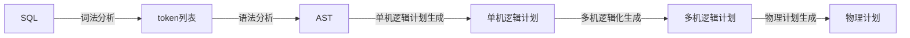
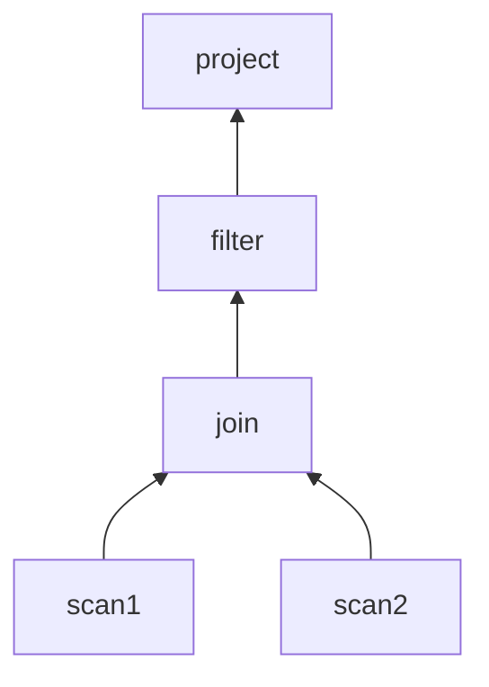

# DORIS简介
Doris是基于MPP架构的交互式SQL数据仓库，主要用于解决近实时的报表和多维分析。
## 1、FE
* 负责存储以及维护集群元数据
* 接收、解析、查询、设计规划整体查询流程
## 2、BE
* 负责数据存储和具体的实施过程。
## 3、Tablet 数据分桶
* 在 Doris 的存储引擎中，用户数据被水平划分为若干个数据分片（Tablet，也称作数据分桶）。每个 Tablet 包含若干数据行。
* 多个 Tablet 在逻辑上归属于不同的分区Partition。
* 一个 Tablet 只属于一个 Partition。而一个 Partition包含若干个 Tablet。
* Tablet 是数据移动、复制等操作的最小物理存储单元。
***
# DORIS-SQL
## 1、流程简介
### 1.1 大致流程

### 1.2 详细流程
```mermaid
flowchart TB
subgraph Aanlyze阶段
direction LR
元信息识别 -.- sql重写 -.- rewrite -.- 类型转化 -.- sql合法性检查 -.- 函数处理- .- 别名处理
end
subgraph SinglePlan阶段
direction LR
slot物化 -.- 投影下推 -.- 谓词下推 -.- 分区粪桶裁剪 -.- join=reorder -.- sort/limit优化 -.- 物化视图选择 -.- 创建PlanNode
end
subgraph DistributedPlan阶段
direction LR
createScanFragment -.- createHashJoinFragment -.- createCrossJoinFragment -.- createSelectNodeFragment -.- createRewriteNodeFragment -.- createSetOperationNodeFragment -.- createMergeNodeFragment -.- createAggregationFragment
end
subgraph Schedule阶段
direction LR
preparse -.- computeScanRangeAssignment -.- computeFragmentExecParams -.- create-result-receiver -.- to-thrift
end
SQL-->Aanlyze阶段-->SinglePlan阶段-->DistributedPlan阶段-->Schedule阶段
SQL-->AST-->单机逻辑计划-->分布式逻辑计划-->分布式物理计划
```
## 2、逻辑计划
* 逻辑计划负责将抽象语法树转成代数关系。
* 代数关系是一棵算子树，每个节点代表一种对数据的计算方式，整棵树代表了数据的计算方式以及流动方向

## 3、物理计划
* 物理计划是在逻辑计划的基础上，根据机器的分布，数据的分布，决定去哪些机器上执行哪些计算操作。

