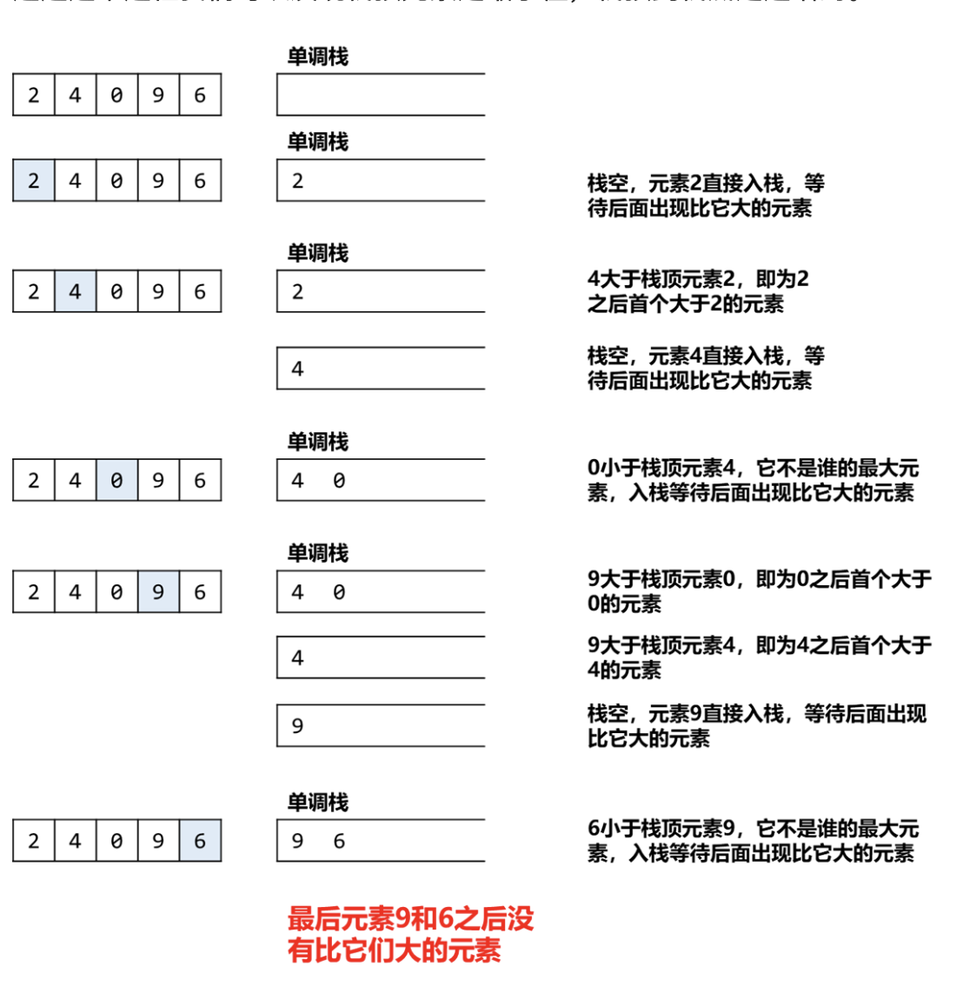
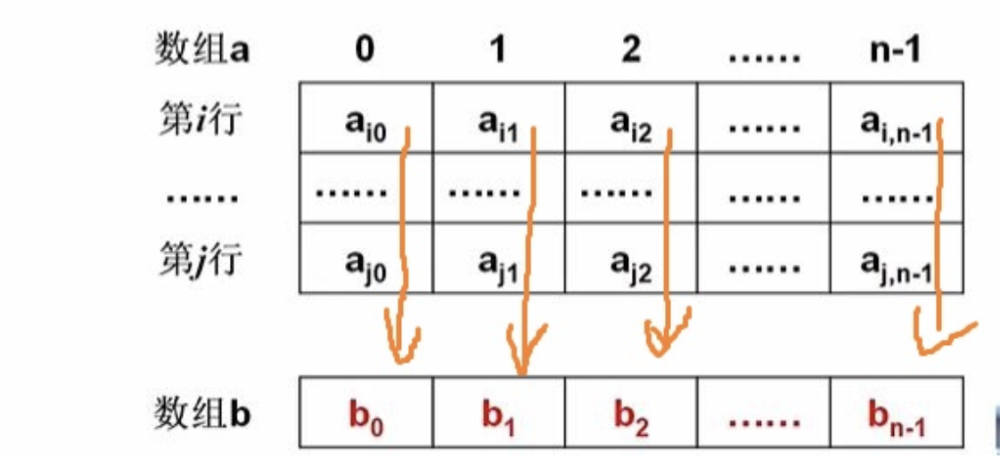

# LeetCode刷题笔记
- [LeetCode刷题笔记](#leetcode刷题笔记)
  - [0、基础算法](#0基础算法)
    - [0.1 快速排序](#01-快速排序)
    - [0.2 单调栈](#02-单调栈)
    - [0.3 链表-快慢指针](#03-链表-快慢指针)
    - [0.4 摩尔投票法](#04-摩尔投票法)
  - [1、HOT 100](#1hot-100)
    - [1.1 HOT100-LC3-无重复最长子串](#11-hot100-lc3-无重复最长子串)
    - [1.2 HOT100-LC4 寻找两个正序数组中的中位数](#12-hot100-lc4-寻找两个正序数组中的中位数)
    - [1.3 HOT100-LC10-正则表达式匹配](#13-hot100-lc10-正则表达式匹配)
    - [1.4 HOT100-LC11-盛最多水的容器](#14-hot100-lc11-盛最多水的容器)
    - [1.5 HOT100-LC15-三数之和](#15-hot100-lc15-三数之和)
    - [1.6 HOT100-LC26-合并K个升序链表](#16-hot100-lc26-合并k个升序链表)
    - [1.7 HOT100-LC31-下一个排列](#17-hot100-lc31-下一个排列)
    - [1.7 HOT100-LC33-搜索旋转排序数组](#17-hot100-lc33-搜索旋转排序数组)
    - [1.8 HOT100-LC42-接雨水](#18-hot100-lc42-接雨水)
    - [1.9 HOT100-LC55-跳跃游戏](#19-hot100-lc55-跳跃游戏)
    - [1.10 HOT100-LC72-编辑距离](#110-hot100-lc72-编辑距离)
    - [1.11 HOT100-LC128-最长连续序列](#111-hot100-lc128-最长连续序列)
    - [1.12 HOT100-LC139-单词拆分](#112-hot100-lc139-单词拆分)
    - [1.13 HOT100-LC142-环形链表(找到环入口)](#113-hot100-lc142-环形链表找到环入口)
    - [1.14 HOT100-LC152-数组的最大乘积](#114-hot100-lc152-数组的最大乘积)
    - [1.15-HOT100-LC287-寻找重复数](#115-hot100-lc287-寻找重复数)
    - [1.16 HOT100-LC437-二叉树路径总和](#116-hot100-lc437-二叉树路径总和)
    - [1.17 HOT100-LC581-最短无序连续子数组](#117-hot100-lc581-最短无序连续子数组)
    - [1.18 HOT100-LC312-戳气球](#118-hot100-lc312-戳气球)
  - [2.ByteDance](#2bytedance)
    - [2.1 ByteDance-LC135-分发糖果](#21-bytedance-lc135-分发糖果)
    - [2.2  ByteDance-LC115-不同的子序列](#22--bytedance-lc115-不同的子序列)
    - [2.3 ByteDance-LC376-摆动序列](#23-bytedance-lc376-摆动序列)
    - [2.4 ByteDance-LC213-打家劫舍二](#24-bytedance-lc213-打家劫舍二)
    - [2.5 ByteDance-LCR170-交易逆序对的总数](#25-bytedance-lcr170-交易逆序对的总数)
    - [2.6 ByteDance-LC92-反转链表92](#26-bytedance-lc92-反转链表92)
    - [2.7 ByteDance-LC516-最长回文序列](#27-bytedance-lc516-最长回文序列)
    - [2.8 ByteDance- LC69-x的平方根](#28-bytedance--lc69-x的平方根)
    - [2.9 ByteDance-LC68-文本左右对齐](#29-bytedance-lc68-文本左右对齐)
    - [2.7 ByteDance-LC2262-字符串的总引力](#27-bytedance-lc2262-字符串的总引力)
    - [2.8 ByteDance-LC386-字典序排数](#28-bytedance-lc386-字典序排数)
    - [2.9 ByteDance-LC670-最大交换](#29-bytedance-lc670-最大交换)
    - [2.10 ByteDance-LC402-移掉K位数字](#210-bytedance-lc402-移掉k位数字)
    - [2.11 ByteDance-LC306-累加数](#211-bytedance-lc306-累加数)
    - [2.12 ByteDance-LC467-环绕字符串中唯一的子字符串](#212-bytedance-lc467-环绕字符串中唯一的子字符串)
    - [2.13 ByteDance-LC2454-下一个更大的元素IV](#213-bytedance-lc2454-下一个更大的元素iv)
    - [2.14 ByteDance-LC718-最长重复数组](#214-bytedance-lc718-最长重复数组)
    - [2.15 ByteDance-LC面试题17.24-最大子矩阵](#215-bytedance-lc面试题1724-最大子矩阵)
    - [2.16 ByteDance-LC1488-避免洪水泛滥](#216-bytedance-lc1488-避免洪水泛滥)
    - [2.17 ByteDance-LC2420-找到所有好下标](#217-bytedance-lc2420-找到所有好下标)
    - [2.18 ByteDance-LC697-数组的度](#218-bytedance-lc697-数组的度)
    - [2.19 ByteDance-LC215-数组中的第K个最大元素](#219-bytedance-lc215-数组中的第k个最大元素)
    - [2.20 ByteDance-LC224-基本计算器](#220-bytedance-lc224-基本计算器)
    - [2.21 ByteDance-LC227-基本计算器二](#221-bytedance-lc227-基本计算器二)
  - [3. CodeTOP-ByteDance](#3-codetop-bytedance)

## 0、基础算法
### 0.1 快速排序
* 算法思路（以升序讲解）
  * 指定一个标识位，找到标识位的位置，把标识位移到哪里，然后重复移动左区间和右区间，即可
  * 如何找？将比他大的移动到右边，将比他小的移动到左边，直至左右重合就是它的位置
* 代码实现要点
  * 如果以最左边为基准，升序时要先找比它大的（先移动右指针）
  * 如果以最左边为基准，降序要先找比它小的（先移动左指针）-->代证明
  * **原因**
    * 反证。
    * 升序时，如果先找比它小的，则相当于l向r移动。最后移动到r的时候，r位置的数一定比最左边的数要大，那么最后移动时相当于把比这个大的数移动过去了，造成排序失败
* 基准点为什么设置在边界
  * 基准点可以随意设置，但是一定要把其移动到边界上
  * 原因：
    * 如果基准点在遍历范围内，会造成基准点被计算进来
    * 当左右指针相遇时，会进行一次交换，会把基准点的位置移动到正确位置，造成数据排序失败

* 代码
```java
private void quickSort(int[] nums, int left, int right) {
    if (left >= right) {
        return;
    }

    int index = nums[left];
    int l = left, r = right;
    while (l < r) {
        while (l < r && nums[r] > index) {
            r--;
        }
        while (l < r && nums[l] <= index) {
            l++;
        }
        swap(nums, l, r);
    }
    nums[left] = nums[l];
    nums[l] = index;
    quickSort(nums, left, l - 1);
    quickSort(nums, l + 1, right);
}
```

### 0.2 单调栈
* 定义(从入栈顺序视角)
  * 单调递增栈：从 **栈底到栈顶** 严格递增
  * 单调递减栈：从 **栈底到栈顶** 严格递减
* 使用场景
  * 递增栈使用场景
    * 从栈顶角度分析，可以寻找下一个比它小的元素
    * 从遍历的当前元素看，
      * 从左到右依次遍历，可以寻找左侧第一个比它小的元素
      * 从右到左依次遍历，可以寻找右侧第一个比它小的元素
  * 递减栈使用场景
    * 从栈顶角度分析，可以寻找下一个比它大的元素
    * 从遍历的当前元素看，
      * 从左到右依次遍历，可以寻找左侧第一个比它大的元素
      * 从右到左依次遍历，可以寻找右侧第一个比它大的元素
* 递增栈场景举例
  * [1,3,4,5,2,9,6]
    * step1:i=0, nums[i]=1, 栈空, 入栈[1]
    * step2:i=1, nums[i]=3, $stack[peek]<=nums[i]$, 入栈[1,3]
      * 栈顶看stack[peek]=1, 当前nums[i]=3,为此找不到比栈顶第一个小的元素，待找
      * 当前nums[i]=3,栈顶stack[peek]=1,比nums[i]小，所以左侧第一个比它小元素是1
    * step3:i=2, nums[i]=4, $stack[peek]<=nums[i]$, 入栈[1,3,4]
      * 栈顶看stack[peek]=3, 当前nums[i]=4,为此找不到比栈顶第一个小的元素，待找
      * 当前nums[i]=4,栈顶stack[peek]=3,比nums[i]小，所以左侧第一个比它小元素是3
    * step4:i=3, nums[i]=5, $stack[peek]<=nums[i]$, 入栈[1,3,4,5]
      * 栈顶看stack[peek]=4, 当前nums[i]=5, 为此找不到比栈顶第一个小的元素，待找
      * 当前nums[i]=5,栈顶stack[peek]=4,比nums[i]小，所以左侧第一个比它小元素是4
    * step5:i=5, nums[i]=2, $stack[peek]>nums[i]$, 入栈[1,2]
      * 栈顶看stack[peek]=5, 当前nums[i]=2, 比栈顶元素小, 为维护单调栈性质，需要把栈中比2大的都探出去
        * 从栈遍历, 此时栈顶是5, 比当前元素nums[i]大, 故第一个比它小的就是nums[i]=2, 故比5大的第一个元素就是2, 将5弹出, 栈[1,3,4]
        * 继续遍历, 此时栈顶是4, 比当前元素nums[i]大, 故第一个比它小的就是nums[i]=2，故比4大的第一个元素就是2,将4弹出,栈[1,3]
        * 继续遍历, 此时栈顶是3, 比当前元素nums[i]大, 故第一个比它小的就是nums[i]=2，故比3大的第一个元素就是2,将3弹出,栈[1]
        * 继续遍历, 此时栈顶是1, 比当前元素nums[i]小, 故找不到比栈定当前元素小的数, 但是从当前元素nums[i]看, 第一个比当前元素nums[i]小的元素就是1
    * 后面依次类推

### 0.3 链表-快慢指针
* 定义
  * 解决链表问题的一种通用手段
* 做法
  * 定义两个指针fast，slow，初始值分别指向head节点
  * 当fast不为null且slow不为null时，fast移动两次，slow移动一次
    * 直至fast与slow相遇-->成环 
    * fast=null || fast.next=null -> 此时slow节点在中间
* 上述做法中
  * 链表总共有偶数节点：slow在中间靠右的节点
  * 链表总共有奇数节点：slow在正中间的节点
  * 如果需要用到上面的特性，需要注意一下

### 0.4 摩尔投票法
* 定义
  * 解决求多数元素的一种算法[1/k]
* 关键idea/重要假设
  * 假设求超过[1/3]的元素数量
  * 两个条件可以知道
    * 1、最多有2个这样的数（候选者）
    * 2、校验候选者是否满足条件
* 证明
  * 共计n个元素，有k个相同元素
  * 则有n-k个非多数元素
  * 由摩尔投票法的 投票+抵消流程，极端情况下可以抵消$\lfloor (n-k) \div 2 \rfloor$次，
  * 故设被抵消后还剩remain个元素，则
    * $remain=k- \lfloor (n-k) \div 2 \rfloor$
    * $remain>= k-(n-k) \div 2$
    * $remian >= (3k-n) \div 2$
    * 由题目可知,k>(n/3)
    * 所以$remain > 0$ --> 也就是投票抵消后至少会剩一个候选者
* 算法模板
  * 1、先求出候选者-->如果超过1/3 候选者一定减不没
  * 2、反向计算候选者是不是超过1/3
  * 注意：抵消后不能设置为新的候选者
```java
public List<Integer> majorityElement(int[] nums) {
    int n = nums.length;
    int a = 0, b = 0;
    int c1 = 0, c2 = 0;
    for (int i : nums) {
        if (c1 != 0 && a == i) c1++;
        else if (c2 != 0 && b == i) c2++;
        else if (c1 == 0 && ++c1 >= 0) a = i;
        else if (c2 == 0 && ++c2 >= 0) b = i;
        else {
            c1--; c2--;
        }
    }
    c1 = 0; c2 = 0;
    for (int i : nums) {
        if (a == i) c1++;
        else if (b == i) c2++;
    }
    List<Integer> ans = new ArrayList<>();
    if (c1 > n / 3) ans.add(a);
    if (c2 > n / 3) ans.add(b);
    return ans;
}
```
* * *

## 1、HOT 100
### 1.1 HOT100-LC3-无重复最长子串
* 题目描述
  * 给定一个字符串s，找出其中不含邮重复字符的 **最长子串** 长度
* 解题方案
  * 滑动窗口+哈希表
    * 窗口记录无重复子串
    * 哈希表用于快速寻找到上一个相同字符的位置
  * 动态规划+哈希表
* 滑动窗口+哈希表代码
  * 注意:hashmap的容量不要错误指定，否则会提高时间复杂度-->原因是hashmap用迭代器删除时，next操作会遍历hashmap的底层数组，数组越大，删除操作的复杂度就越高
```java
public int lengthOfLongestSubstring(String s) {
    if (Objects.isNull(s) || s.length() == 0) {
        return 0;
    }
    int right = 0;
    Map<Character, Integer> char2Index = new HashMap<>();
    int max = 0;
    while (right < s.length()) {
        char c = s.charAt(right);
        if (char2Index.containsKey(c)) {
            max = Math.max(char2Index.size(), max);
            int left = char2Index.get(c);
            char2Index.entrySet().removeIf(x->x.getValue()<=left);
        }
        char2Index.put(c, right);
        right++;
    }
    return Math.max(char2Index.size(), max);
}
```
* 动态规划+哈希表
  * dp方程如下：
    * dp[i] 表示的是 以i为结尾的 最长子串长度；用j来表达跟上一个i相等的字符，即 **s[i] == s[j]**
    * 如果前面的字符串没有满足 s[i]==s[j],则dp[i] = dp[i-1] + 1;
    * 如果有满足 s[i]==s[j],要看j的位置，在(i-1)包含的最长无重复子串包不包含j
      * 如果包含j,则dp[i] = i-(j+1)+1
      * 如果不包含j,则dp[i] = dp[i-1]+1
    * 边界情况：当i=0时，dp[0] = 1恒成立。
  * 上述难点是找到j,所以可以用hashmap来记录j的位置；
  * 根据动态方程可以看出，dp[i]只跟dp[i-1]有关，所以可以用变量tmp来替代
  * 具体代码如下
```java
public int lengthOfLongestSubstring(String s) {
    Map<Character, Integer> indexMap = new HashMap<>();
    int tmp = 0, max = 0;
    for (int i = 0; i < s.length(); i++) {
        char cur = s.charAt(i);

        //to write dynamic planning
        if (i == 0) {
            tmp = 1;
        } else if (indexMap.containsKey(cur)) {
            int lastIndex = indexMap.get(cur);
            if (tmp >= i - lastIndex) {
                //contain last same char
                tmp = i - (lastIndex + 1) + 1;
            } else {
                tmp = tmp + 1;
            }
        } else {
            tmp = tmp + 1;
        }

        max = Math.max(tmp, max);
        indexMap.put(cur, i);
    }
    return max;
}
```

### 1.2 HOT100-LC4 寻找两个正序数组中的中位数
* 题目描述
  * 给定两个正序数组，寻找这两个有序数组的中位数；并要求时间复杂度log(m+n)
  * [1,2],[3,4] --> 2.5000
  * [1,3],[2] --> 2.0
* 解题分析
  * 由于时间复杂度要求log级别，所以会想到利用 **二分法** 来解决
  * 当m+n是奇数时，中间的数即为所求
  * 当m+n时偶数时，中间两数之和除2即位所求
  * 所以可以看出，该题的本质是两个有序数组找第k大的数（和第k+1大的数即可），然后要利用二分法来控制时间复杂度
* 解题思路
  * 可以从nums1中找m1个元素，那么在nums2中找k-m1个元素即可
  * m1的寻找可以用二分法来排除，如下所示
    * 让left指向nums1的头部，让right指向num2的尾部
    * 取 **m1 = left+(rigt-left)/2** , 则 **m2=k-m1**
    * 如果nums1[m1]<=nums[m2],那么可以说明nums1数组的前m1的元素都是在前k大的数中，**不是第k大的那个数**，此时要让left=m1+1
    * 相反如果nums[m1]>nums[m2],说明要在细化的看一下(left~m1)之间的区间，没办法直接排除，此时令right=m1即可
    * 如果m2的长度超过了数组的长度，则说明nums1中的元素取的不够，要多取一些，令left=m1+1
  * 最后从m1取几个元素，从m2中取几个元素就确定了
    * 如果m1=0，则说明m1中的元素过大，不包含第k大，要从nums2中取
    * 如果m2=0，则说明m2中的元素过大，不包含第k大，要从nums1中取
    * 否则，判断一下nums1中第m1个元素和nums2中第m2个元素，谁大哪个就是第k大的数
  * 代码如下
```java
public  double findMedianSortedArrays(int[] nums1, int[] nums2) {
    int len1 = nums1.length;
    int len2 = nums2.length;
    int k = (len1 + len2 + 1) / 2;
    if ((len1 + len2) % 2 == 0) {
        return (findK(nums1, nums2, k) + findK(nums1, nums2, k + 1)) * 0.5;
    } else {
        return findK(nums1, nums2, k);
    }
}

public int findK(int[] nums1, int[] nums2, int k) {
    int len1 = nums1.length;
    int len2 = nums2.length;

    if (len1 > len2) {
        //因为是以nums1为依据，用nums2来补剩下的数，所以保证nums2的长度更长一些，防止下面发生越界
        return findK(nums2, nums1, k);
    }

    int left = 0;
    int right = len1;
    while (left < right) {
        int m1 = (right + left) / 2;
        int m2 = k - m1;
        if (m2 > len2) {
            left = m1 + 1;
        } else if (nums1[m1] < nums2[m2 - 1]) {
            left = m1 + 1;
        } else {
            right = m1;
        }
    }

    int m1 = left;
    int m2 = k - m1;

    if (m1 == 0) {
        //代表m1中没有能用的，取m2即可
        return nums2[m2 - 1];
    } else if (m2 == 0) {
        //代表m2很大，取m1即可
        return nums1[m1 - 1];
    } else {
        return Math.max(nums1[m1 - 1], nums2[m2 - 1]);
    }
}
```
### 1.3 HOT100-LC10-正则表达式匹配
* 题目描述
  * 给定字符串s和p，实现一个支持 '.' 和 '*' 的正则表达式匹配
* 解题思路：
  * 递归
  * 动态规划
* 递归
  * 遍历两个字符串，判断两个字符是否相等或p是否是'.'
    * 如果相等，要判断一下是单一匹配，还是*匹配
    * 如果p+1是*，则进行*匹配
  * 如果当前两个遍历位置不相等，判断p+1是不是'*'
    * 如果是，则可以匹配0次
    * 如果不是，则不匹配
  * 代码
  ```java
    public boolean isMatch(String s, String p) {
        return match(s.toCharArray(), p.toCharArray(), 0, 0);
    }

    private boolean match(char[] s, char[] p, int sIndex, int pIndex) {
        if (sIndex == s.length && pIndex == p.length) {
            return true;
        }

        if (sIndex < s.length && pIndex < p.length && canEqual(s, p, sIndex, pIndex)) {
            if (pIndex + 1 < p.length && p[pIndex + 1] == '*') {
                //match zero / multi
                return match(s, p, sIndex, pIndex + 2)  || match(s, p, sIndex + 1, pIndex);
            } else {
                //match one
                return match(s, p, sIndex+1, pIndex + 1);
            }
        } else if (pIndex + 1 < p.length && p[pIndex + 1] == '*') {
            return match(s, p, sIndex, pIndex + 2);
        } else {
            return false;
        }
    }

    private boolean canEqual(char[] s, char[] p, int sIndex, int pIndex) {
        return (sIndex < s.length && pIndex < p.length && (s[sIndex] == p[pIndex])) || (pIndex < p.length && p[pIndex] == '.');
    }
  ```
* 动态规划
  * 定义二维数组dp[i][j],表示0-i的s子串和0-j的子串p是否满足匹配
  * 那么dp方程如下：
    * 如果s[i]=p[j]-->dp[i][j] = dp[i-1][j-2]
    * 如果上述不成立，判断p[j]是不是*，如果是*有机会做多次或0次匹配
      * 如果s[i-1]=p[j-1] || p[j-1] == '.'，
        * 则有机会进行多次匹配，dp[i][j] = dp[i-1][j],也就是让p[j-1]* 这个字符在顶替一下
        * 也可以不匹配，dp[i][j] = dp[i][j-2],让p[j-1]*不匹配s
      * 如果s[i-1] !=p[j-1] && p[j-1] == '.',则只能让这个* 不匹配p[j-1],要看下不匹配是否满足dp[i][j] = dp[i][j-2]
  * 初始化
    * 让dp[s.length()+1][p.length()+1]的范围比s和p的长度大一，这样可以减少dp转移方程时的越界判断量
    * 且dp[0][0]=true --> 两个空串恒匹配
    * 如果想dp[0][j]=true，那么一定是用重复的.*来稀释，所以判断有几个.*出现，*的index，则是true
  * 代码
```java
public boolean isMatch(String s, String p) {
    char[] ss = s.toCharArray();
    char[] pp = p.toCharArray();
    boolean[][] dp = new boolean[ss.length + 1][pp.length + 1];

    //init otherwise will array index overreach
    dp[0][0] = true;
    for (int j = 2; j <= pp.length; j += 2)
        dp[0][j] = dp[0][j - 2] && p.charAt(j - 1) == '*';

    for (int i = 1; i <= ss.length; i++) {
        for (int j = 1; j <= pp.length; j++) {
            if (canEqual(ss, pp, i - 1, j - 1)) {
                dp[i][j] = dp[i - 1][j - 1];
            } else if (pp[j - 1] == '*') {
                if (canEqual(ss, pp, i - 1, j - 2)) {
                    dp[i][j] = dp[i][j - 2] || dp[i - 1][j];
                } else {
                    dp[i][j] = dp[i][j - 2];
                }
            } else {
                dp[i][j] = false;
            }
        }
    }

    return dp[ss.length][pp.length];
}

private boolean canEqual(char[] s, char[] p, int sIndex, int pIndex) {
    return (sIndex < s.length && pIndex < p.length && (s[sIndex] == p[pIndex])) || (pIndex < p.length && p[pIndex] == '.');
}
```
### 1.4 HOT100-LC11-盛最多水的容器
* 题目描述
  * 给定一个长度为 n 的整数数组 height 。有 n 条垂线，第 i 条线的两个端点是 (i, 0) 和 (i, height[i]) 。
  * 找出其中的两条线，使得它们与 x 轴共同构成的容器可以容纳最多的水。
* 解题思路
  * 双指针
    * 题目所求为下面公式的最大值：Math.min(height[right],height[left])*(right-left)
    * 比较left和right的高度，因为left和right是相遇运动，会让(right-left)变小，那么如果要让整个值变大，只能是淘汰低的，直至left和right相遇
  * 正确性证明
    * [原证明](https://leetcode.cn/problems/container-with-most-water/solutions/94102/on-shuang-zhi-zhen-jie-fa-li-jie-zheng-que-xing-tu)
    * 核心点在于每次比较高度，可以排除 **低高度** 的最大值，这样做相遇运动时不会丢数据
    * 
  * 代码
```java
public int maxArea(int[] height) {
    int left = 0, right = height.length - 1;
    int max = 0;
    while (left < right) {
        max = Math.max(max, (right - left) * Math.min(height[left], height[right]));
        if (height[left] > height[right]) {
            right--;
        } else {
            left++;
        }
    }
    return max;
}
```

### 1.5 HOT100-LC15-三数之和
* 题目描述
  * 给定一个整数数组 nums ，判断是否存在三元组 [nums[i], nums[j], nums[k]] 满足 i != j、i != k 且 j != k。同时还满足 nums[i] + nums[j] + nums[k] == 0 。
* 解题思路
  * 快排 + 双指针求解两数和
* 代码
```java
public List<List<Integer>> threeSum(int[] nums) {
    quickSort(nums, 0, nums.length - 1);
    List<List<Integer>> result = new ArrayList<>();
    for (int i = 0; i < nums.length; i++) {
        if (nums[i] > 0) {
            break;
        }
        if (i > 0 && nums[i] == nums[i - 1]) {
            continue;
        }

        int remain = -nums[i];
        int l = i + 1, r = nums.length - 1;
        while (l < r) {
            int sum = nums[l] + nums[r];
            if (sum == remain) {
                List<Integer> objects = new ArrayList<>(3);
                objects.add(nums[i]);
                objects.add(nums[l]);
                objects.add(nums[r]);
                result.add(objects);
                while (l < r && nums[l + 1] == nums[l]) {
                    l++;
                }
                l++;

                while (l < r && nums[r - 1] == nums[r]) {
                    r--;
                }
                r--;
            } else if (sum > remain) {
                r--;
            } else {
                l++;
            }
        }
    }
    return result;
}

private void quickSort(int[] nums, int left, int right) {
    if (left >= right) {
        return;
    }

    int index = nums[left];
    int l = left, r = right;
    while (l < r) {
        while (l < r && nums[r] > index) {
            r--;
        }
        while (l < r && nums[l] <= index) {
            l++;
        }
        swap(nums, l, r);
    }
    nums[left] = nums[l];
    nums[l] = index;
    quickSort(nums, left, l - 1);
    quickSort(nums, l + 1, right);
}

private void swap(int[] nums, int l, int r) {
    int tmp = nums[l];
    nums[l] = nums[r];
    nums[r] = tmp;
} 
```
### 1.6 HOT100-LC26-合并K个升序链表
* 题目描述
  * 给定K个升序链表，合并成一个升序链表
  * 有时间复杂度要求
* 解题思路：假定共有K个链表，N个节点
  * 暴力解法时间复杂度分析：平均每个节点会比较N-1次，总共时间复杂度是$N*(N-1)$，也就是$O(N^2)$
  * 分治法时间复杂度分析: 两两合并，将合并后的链表在进行合并，这样其中每个链表会比较$logK$次，共有K个链表，也就是$K*logK$次。每个链表平均有$N/K$个节点，故整体时间复杂度为：$(N/K)*K*logK = O(N*logK)$
* 代码
```java
public ListNode mergeKLists(ListNode[] lists) {
    if (null == lists || lists.length == 0) {
        return null;
    }
    if (lists.length == 1) {
        return lists[0];
    }

    int start = 0;
    int i = 0;
    int size = lists.length;

    while (size != 1) {
        while (i < size) {
            if (i + 1 < size) {
                lists[start++] = mergeTwo(lists[i], lists[i + 1]);
            } else {
                lists[start++] = lists[i];
            }
            i += 2;
        }
        size = start;
        i = 0;
        start = 0;
    }

    return lists[0];
}

public ListNode mergeTwo(ListNode l1, ListNode l2) {
    if (null == l1) {
        return l2;
    }

    if (null == l2) {
        return l1;
    }

    ListNode result = new ListNode();
    ListNode tmp = result;

    while (null != l1 && null != l2) {

        if (l1.val <= l2.val) {
            tmp.next = new ListNode(l1.val);
            l1 = l1.next;
        } else {
            tmp.next = new ListNode(l2.val);
            l2 = l2.next;
        }
        tmp = tmp.next;
    }

    if (null != l1) {
        tmp.next = l1;
    }

    if (null != l2) {
        tmp.next = l2;
    }

    return result.next;
}
```
  
### 1.7 HOT100-LC31-下一个排列
* 题目描述
  * 寻找字典序下的下一个排列，例如1，2，3-->下一个排列就是1，3，2
* 解题思路
  * 直观上看，如果一个排列是 **降序排列** ，那么不存在比当前排列更大的字典序排列，例如3，2，1
  * 故关键思路1:一定是从后往前看，那个升序的点才是核心点
  * 例如[1,3,4,7,6,5,2],一定是在4,7的位置才可能出现下一个排列
  * 并且从4的位置看，[7,6,5,2]没有比它更大的字典序
  * 如何根据这个位置进而找到整个排列的下个排列？ 从后往前遍历，找到比4大的那个位置，也就是5，并且将4和5交换，然后将[7,6,4,2]做升序排序后，就可以得到最下一个字典序最大的
  * 由于[7,6,4,2]肯定是降序的，故可以采取收尾交换排序的方式，减少时间复杂度
* 代码
```java
public void nextPermutation(int[] nums) {
    // step 1 : traverse array from end to start
    // find the flag pos where nums[i] > nums[i-1]
    int i = nums.length - 1;
    while (i - 1 >= 0 && nums[i] <= nums[i - 1]) {
        i--;
    }
    int left = i;

    // handle start case
    if (i == 0) {
        headToTailSort(nums, 0, nums.length - 1);
        return;
    }

    // step 2 : traverse array from end to left
    // find the number which more than nums[flag]
    i = nums.length - 1;
    while (i > left && nums[i] <= nums[left - 1]) {
        i--;
    }
    int right = i;

    // step 3 : swap nums[left],nums[right]
    swap(nums, left - 1, right);

    // step 4 : sort array from left to end, ensure asc order(skip:head to tail exchange)
    headToTailSort(nums, left, nums.length - 1);
}

private void headToTailSort(int[] nums, int start, int end) {
    int left = start, right = end;
    while (left < right) {
        swap(nums, left, right);
        left++;
        right--;
    }
}

private void swap(int[] nums, int a, int b) {
    int tmp = nums[a];
    nums[a] = nums[b];
    nums[b] = tmp;
}
```

### 1.7 HOT100-LC33-搜索旋转排序数组
* 题目描述
  * 整数数组 nums 按升序排列，数组中的值 互不相同 。
  * 给定一个 旋转后 的数组 nums 和一个整数 target ，如果 nums 中存在这个目标值 target ，则返回它的下标，否则返回 -1 。
* 解题思路
  * 定理一：只有在顺序区间内才可以通过区间两端的数值判断target是否在其中。
  * 定理二：判断顺序区间还是乱序区间，只需要对比 left 和 right 是否是顺序对即可，nums[left] <= nums[right]，顺序区间，否则乱序区间。
  * 定理三：每次二分都会至少存在一个顺序区间
  * 通过不断的用Mid二分，根据定理二，将整个数组划分成顺序区间和乱序区间，然后利用定理一判断target是否在顺序区间，如果在顺序区间，下次循环就直接取顺序区间，如果不在，那么下次循环就取乱序区间。
* 小提示
  * 该题大致思路如上，但是要注意边界条件，如果用left和middle来比较数组升序和降序时，当left和right相邻时，要记住二分取值的点是left,所以比较时要$nums[left]<=nums[middle]$,保障范围
* 代码
```java
public int search(int[] nums, int target) {
    int left = 0, right = nums.length - 1;
    while (left <= right) {
        int middle = (left + right) / 2;
        if (target == nums[middle]) {
            return middle;
        }

        if (nums[middle] < nums[right]) {
            if (nums[middle] < target && target <= nums[right]) {
                left = middle + 1;
            } else {
                right = middle - 1;
            }
        } else {
            if (nums[left] <= target && target < nums[middle]) {
                right = middle - 1;
            } else {
                left = middle + 1;
            }
        }
    }
    return -1;
}
```

### 1.8 HOT100-LC42-接雨水
* 题目描述
  *  * 给定 n 个非负整数表示每个宽度为 1 的柱子的高度图，计算按此排列的柱子，下雨之后能接多少雨水。
* 解法
  * 按行求
  * 单调栈
  * 按列求
* 按行求
  * 主旨思想：求第 i 层的水，遍历每个位置，如果当前的高度小于 i，并且两边有高度大于等于 i 的，说明这个地方一定有水，水就可以加1
```java
public int trap(int[] height) {
    int max = 0;
    for (int i : height) {
        max = Math.max(i, max);
    }

    int sum = 0;
    for (int i = 1; i <= max; i++) {
        boolean start = false;
        int tmp = 0;
        for (int j : height) {
            if (start && j < i) {
                tmp++;
            }

            if (j >= i) {
                sum += tmp;
                tmp = 0;
                start = true;
            }
        }
    }
    return sum;
}
```
* 单调栈
  * 大致思想：如果数组呈降序排列，那一定没有水能接住，只有遇到升序的情况才可能接到水，故可以用一个**递减栈**
  * 遍历到当前元素，如果该元素比栈顶大，那么此时可以接到水。此时栈顶出是凹字形的最低点，比较次栈的和当前元素的大小即可获取能接住的高度
```java
public int trap(int[] height) {
    Stack<Integer> stack = new Stack<>();
    int sum = 0;

    for (int i = 0; i < height.length; i++) {
        while (!stack.isEmpty() && height[i] >= height[stack.peek()]) {
            int high = height[stack.pop()];
            if (stack.isEmpty()) {
                break;
            }
            int minHigh = Math.min(height[stack.peek()], height[i]);
            sum += (minHigh - high) * (i - stack.peek() - 1);
        }
        stack.push(i);
    }
    return sum;
}
```
* 按列求
  * 从每一列看，该列能接住多少水由其左侧及右侧的最高处决定
```java
public int trap(int[] height) {
    int[] maxLeft = new int[height.length];
    int[] maxRight = new int[height.length];

    for (int i = 1; i < height.length; i++) {
        maxLeft[i] = Math.max(maxLeft[i - 1], height[i - 1]);
    }
    for (int i = height.length - 2; i >= 0; i--) {
        maxRight[i] = Math.max(maxRight[i + 1], height[i + 1]);
    }

    int sum = 0;
    for (int i = 1; i < height.length - 1; i++) {
        int min = Math.min(maxLeft[i], maxRight[i]);
        if (min > height[i]) {
            sum += min - height[i];
        }
    }
    return sum;
}

//优化代码
public int trap(int[] height) {
    int len = height.length;
    int left=0,right=len-1,leftMax = height[0],rightMax = height[len-1];


    int result = 0;
    while(left<right){
        leftMax = Math.max(leftMax, height[left]);
        rightMax = Math.max(rightMax, height[right]);
        if (leftMax <rightMax) {
            // 左指针的leftMax比右指针的rightMax矮
            // 说明：左指针的右边至少有一个板子 > 左指针左边所有板子
            // 根据水桶效应，保证了左指针当前列的水量决定权在左边
            // 那么可以计算左指针当前列的水量：左边最大高度-当前列高度
            result += leftMax - height[left];
            ++left;
        } else {
            result += rightMax - height[right];
            --right;
        }
    }
    return result;
}
```
### 1.9 HOT100-LC55-跳跃游戏
* 题目描述
  * 给定非负整数数组 nums ，最初位于数组的第一个下标 。数组中的每个元素代表你在该位置可以跳跃的最大长度。判断你是否能够到达最后一个下标。
* 解题思路
  * 动态规划
  * 贪心
* 动态规划
  * 定义dp[i],代表i下标一次能跳跃的最大位置
  * 动态方程
    * 下标i一次能到达的最大位置右两点决定
      * 该位置跳跃的最远距离没有上一个下标跳的远：dp[i] = dp[i-1]
      * 该位置跳跃的最远距离比上一个下表跳的远 dp[i] = i+nums[i] 
    * 取上述两者的最大值即可 $dp[i] = Math.max(dp[i-1],nums[i]+i)$
  * 如何判断能否跳到最后？
    * 如果当前能跳的最大位置 大于数组长度，即可以 $dp[i]>nums.length$
    * 如果当前跳的最大位置 等于 该数组下标，也就是跳不动了，则不可以跳到最后 $dp[i]==i$
  * 代码如下
```java
public boolean canJump(int[] nums) {
    if (nums.length == 1) {
        return true;
    }
    if (nums[0] == 0) {
        return false;
    }
    int[] dp = new int[nums.length];
    dp[0] = nums[0];
    int max = nums.length - 1;
    for (int i = 1; i < nums.length; i++) {
        dp[i] = Math.max(dp[i - 1], i + nums[i]);
        if (dp[i] >= max) {
            return true;
        }
        if (dp[i] == i) {
            return false;
        }
    }
    return false;
}
```
* 贪心
  * 记录当前能跳到的最大下标maxRight
  * 遍历数组，如果当前下标 $i<=maxRight$,一定说明可以走到这个下标处，此时更新一下maxRight，即$maxRight = Math.max(maxRight,i+nums[i])$
  * 如果走不到，则说明不能跳到最后
  * 如果当前maxRight比数组长度大，那么就可以
```java
public boolean canJump(int[] nums) {
    if (nums.length == 1) {
        return true;
    }
    if (nums[0] == 0) {
        return false;
    }

    int maxRight = 0;
    for (int i = 0; i < nums.length; i++) {
        if (maxRight >= i) {
            maxRight = Math.max(i + nums[i], maxRight);
        } else {
            return false;
        }

        if (maxRight >= nums.length - 1) {
            return true;
        }
    }
    return false;
}
```

### 1.10 HOT100-LC72-编辑距离
* 题目描述
  * 给定两个单词 word1 和 word2， 请返回将 word1 转换成 word2 所使用的最少操作数。
  * 每次操作对word1添加一个字符、删除一个字符、或替换一个字符
* 解题思路
  * 动态规划
* 动态规划
  * 1、定义dp[i][j] --> 代表（0,i）的word1子串转换成word2子串的最少操作数
  * 2、dp方程
    * 如果word1[i] == word[j] --> $dp[i][j] = dp[i-1][j-1]$
    * 否则
      * 添加字符：相当于是从(0,i-1)的word1的子串添加一个字符，使得word1(0,i) == word2(0,j)-->$dp[i][j] = dp[i-1][j]+1$
      * 删除字符：相当于是在(0,i)的word1子串，删除i位置的字符，使得word1(0,i) == word2(0,j-1)-->$dp[i][j] = dp[i][j-1]+1$
      * 替换字符：相当于是把i处的word1字符替换成word2的j字符，故从word1(0,i-1) = word2(0,j-1)的基础上加一个操作即可-->$dp[i][j] = dp[i-1][j-1]+1$ 
      * 上述三种操作取最小值就是dp[i][j]
* 代码如下
```java
public int minDistance(String word1, String word2) {
    int l1 = word1.length();
    int l2 = word2.length();
    int[][] dp = new int[l1 + 1][l2 + 1];
    for (int i = 1; i <= l2; i++) {
        dp[0][i] = i;
    }
    for (int i = 1; i <= l1; i++) {
        dp[i][0] = i;
    }

    for (int i = 1; i <= l1; i++) {
        for (int j = 1; j <= l2; j++) {
            if (word1.charAt(i - 1) == word2.charAt(j - 1)) {
                dp[i][j] = dp[i - 1][j - 1];
            } else {
                int add = dp[i - 1][j] + 1;
                int delete = dp[i][j - 1] + 1;
                int replace = dp[i - 1][j - 1] + 1;
                dp[i][j] = Math.min(add, Math.min(delete, replace));
            }
        }
    }

    return dp[l1][l2];
}
```
### 1.11 HOT100-LC128-最长连续序列
* 题目描述
  * 给定一个未排序的整数数组 nums ，找出数字连续的最长序列（不要求序列元素在原数组中连续）的长度。
  * 限制时间复杂度O(n);
* 解法
  * 哈希表 + 是否尾节点过滤
  * 动态规划，区间优化
* 哈希表 + 是否尾节点过滤
  * 将数组的元素线load到哈希表中
  * 依次遍历
    * 如果当前节点没有后续节点，也就是尾节点，则去找1️以该节点为尾节点的序列
    * 如果有后续节点，则说明在前面的过程中已经遍历过了，故不用再次遍历
    * 时间复杂度分析：大体分为两层循环，但是由于尾节点的优化，每个元素只会遍历2次，故时间复杂度是O(2n)
```java
public int longestConsecutive(int[] nums) {
    Set<Integer> set = new HashSet<Integer>();
    int ans = 0;
    for (int num : nums) {
        set.add(num);
    }
    for (int num : nums) {
        int x = num;
        // 说明x是连续序列的开头元素
        if (!set.contains(x - 1)) {
            while (set.contains(x + 1)) {
                x++;
            }
        }
        ans = Math.max(ans, x - num + 1);
    }

    return ans;
}
```
* 动态规划（区间优化）
  * 定义hashmap，key是当前元素，value是包含当前元素的最长子序列
  * 遍历数组到i处
    * 如果数组中出现过元素nums[i]-1或nums[i]+1，意味着当前元素可以归入左或右序列
      * 那么此时假如左右序列的长度分别为left、right，显然加入nums[i]后，这整段序列的长度为 1+left+right
      * **而由于这一整段序列中，只可能在左右两端扩展**，所以只需要更新左右两端的value值即可，不用关心中间节点的长度
    * 数组中未出现过元素nums[i]-1或nums[i]+1，意味着当前元素所在的连续序列就是自身（只有自己一个元素）。
```java
public int longestConsecutive(int[] nums) {
    Map<Integer, Integer> map = new HashMap<Integer, Integer>();
    int res = 0;
    for (int num : nums) {
        if (!map.containsKey(num)) {
            int left = map.get(num - 1) == null ? 0 : map.get(num - 1);
            int right = map.get(num + 1) == null ? 0 : map.get(num + 1);
            int cur = 1 + left + right;
            if (cur > res) {
                res = cur;
            }
            map.put(num, -1);
            map.put(num - left, cur);
            map.put(num + right, cur);
        }
    }
    return res;
}
```
### 1.12 HOT100-LC139-单词拆分
* 题目描述
  * 给你一个字符串 s 和一个字符串列表 wordDict 作为字典。如果可以利用字典中出现的一个或多个单词拼接出 s 则返回 true。
* 解法
  * 递归搜索
  * 动态规划
* 递归搜索
  * 遍历字符串，与字典比较
  * 如果当前开始的位置能与字典对照上，则继续向下搜索，否则则失败
```java
public boolean wordBreak(String s, int index, List<String> wordDict) {
    if (index == s.length()) {
        return true;
    }
    for (String string : wordDict) {
        if (s.startsWith(string, index) && wordBreak(s, index + string.length(), wordDict)) {
            return true;
        }
    }
    return false;
}
```
* 动态规划
  * 定义dp,boolean[] dp, dp[i]则代表0-i处的字符串是否从字典中搜索
  * 初始值：dp[0] 代表空串,默认可以搜索
  * dp方程
    * 将字符串分为两段(0,j)和(j,i)
    * 如果(0,j)可以搜索，并且(j,i)的子串也在字典中能搜索到才可以，故方程如下
      * dp[i] = dp[j] && dict.contain(s.substring(j,i))
```java
public boolean wordBreak(String s, List<String> wordDict) {
    boolean[] dp = new boolean[s.length() + 1];
    dp[0] = true;
    for (int i = 1; i <= s.length(); i++) {
        for (int j = 0; j <= i; j++) {
            if (dp[j] && wordDict.contains(s.substring(j, i))) {
                dp[i] = true;
                break;
            }
        }
    }
    return dp[s.length()];
}
```

### 1.13 HOT100-LC142-环形链表(找到环入口)
* 题目描述
  * 给定一个链表的头节点 head ，返回链表开始入环的第一个节点。 如果链表无环，则返回 null。
* 做法
  * 1、快慢指针判断是否有环
  * 2、有环后定位入口
    * 有环则快慢指针相遇，此时将相遇节点标记为快指针
    * 利用寻找链表倒数第n个题目的方式，将head节点作为慢指针节点，快慢相遇则为入口
* 有环情况下推导
  * 假定环外有a个节点，环内有b个节点，快指针在环内走了$n_1$次，漫指针在环内走了$n_2$次,入口距离相遇位置是d
  * 快针走过节点数(慢指针的步数+n个环内步数)：公式1:$f=a+n_1b+d$
  * 慢指针走过节点数: 公式2:$s=a+n_2b+d$
  * 所以公式3:$f-s = (n_1-n2)b$
  * 又因为公式4：$f=2s$, 所以公式5:$s=(n_1-n_2)b$
  * 有公式2和公式5可知$a+d =(n^1)b$
  * 也就是慢指针从环的入口处在转一圈走过的距离 = 从初始节点到环入口的距离
* 代码如下
```java
public ListNode detectCycle(ListNode head) {
    if (head == null || head.next == null) {
        return null;
    }
    ListNode slow = head, fast = head;
    while (null != fast) {
        fast = fast.next;
        if (null == fast) {
            return null;
        }
        fast = fast.next;

        slow = slow.next;

        if (fast == slow) {
            break;
        }
    }
    if (null == fast) {
        return null;
    }

    slow = head;
    while (slow != fast) {
        slow = slow.next;
        fast = fast.next;
    }
    return fast;
}
```

### 1.14 HOT100-LC152-数组的最大乘积
* 题目描述
  * 给你一个整数数组 nums ，请你找出数组中乘积最大的非空连续子数组（该子数组中至少包含一个数字），并返回该子数组所对应的乘积。
* 做法
  * 动态规划
* 动态规划
  * 连续乘积可以有过程中的正数得来，也可以右过程中的负数得来
  * 故定义两个dp数组，max[]和min[]
  * $nums[i]>=0$ 时：$max[i] = Math.max(max[i-1]*nums[i],nums[i])$，$min[i] = Math.min(min[i-1]*nums[i],nums[i])$
  * $nums[i]<0$ 时：$max[i] = Math.max(min[i-1]*nums[i],nums[i])$,，$min[i] = Math.min(max[i-1]*nums[i],nums[i])$
  * 同时对比max[i]和最大值即可
* 代码如下
```java
public int maxProduct(int[] nums) {
    int positive = nums[0];
    int negative = nums[0];
    int result = nums[0];
    for (int i = 1; i < nums.length; i++) {
        if (nums[i] >= 0) {
            positive = Math.max(nums[i], positive * nums[i]);
            negative = Math.min(nums[i], negative * nums[i]);
        }
        if (nums[i] < 0) {
            int negative1 = negative;
            int positive1 = positive;
            positive = Math.max(negative1 * nums[i], nums[i]);
            negative = Math.min(positive1 * nums[i], nums[i]);
        }

        result = Math.max(result, positive);
    }

    return result;
}
```
### 1.15-HOT100-LC287-寻找重复数
* 题目描述
  * 给定一个包含 n + 1 个整数的数组 nums ，其数字都在 [1, n] 范围内（包括 1 和 n），可知至少存在一个重复的整数。
  * 假设 nums 只有 一个重复的整数 ，返回 这个重复的数 。
  * 不改变数组 
* 做法
  * 将其转化成循环链表
* 循环链表找入口
  * 大致做法
    * 将数组想成链表，数组下标为链表的val,数组值为链表的next节点
    * 例如[1,3,4,2,2,5] n=6
      * 0->1, 1->3, 2->4, 3->2, 4->2, 5->5
    * **由于共有n+1个节点，所以这个链表串起来后一定成环，且环的入口就是重复数**
    * 故可以将其转化为链表的思想
* 代码
```java
public int findDuplicate(int[] nums) {
    int slow = 0;
    int fast = 0;
    while (true) {
        slow = nums[slow];
        fast = nums[nums[fast]];
        if (slow == fast) {
            break;
        }
    }

    // 第二阶段：寻找循环的入口
    fast = 0;
    while (slow != fast) {
        slow = nums[slow];
        fast = nums[fast];
    }

    return slow;
}
```
### 1.16 HOT100-LC437-二叉树路径总和
* 题目描述
  * 给定一个二叉树的根节点 root ，和一个整数 targetSum ，求该二叉树里节点值之和等于 targetSum 的 路径 的数目。
  * 路径 不需要从根节点开始，也不需要在叶子节点结束，但是路径方向必须是向下的（只能从父节点到子节点）。
* 解题思路
  * 深度优先搜索
  * 前缀和
* 深度优先搜索
  * 过程：
    * 前序遍历，记录当前的路径
    * 遍历到节点时，从后往前计算路径和，看是否等于target，如果相等记录起来
    * 然后搜索左子树和右子树，累加相应的结果即可。
  * 代码：
  ```java
   public int pathSum(TreeNode root, int targetSum) {
       return dfs(root,new ArrayList<>(),targetSum);
    }

    private int dfs(TreeNode root, List<Integer> paths, Integer target) {
        if (root == null) {
            return 0;
        }

        paths.add(root.val);
        int result = 0;
        long sum = 0;
        for (int j = paths.size() - 1; j >= 0; j--) {
            sum += paths.get(j);
            if (sum == target) {
                result++;
            }
        }
        result += dfs(root.left, paths, target);
        result += dfs(root.right, paths, target);

        paths.remove(paths.size() - 1);
        return result;
    }
  ```
* 前缀和
  * 过程
    * 维护一个前缀和，记录当前和在之前有多少个情况
    * 当遍历到当前节点时，判断当前和减去目标值在前缀和中是否有记录，若有，则说明符合目标情况 $prefixMap.contains(currentSum-target)$
    * 然后遍历左右子树，将结果做累加
    * 核心点：在这个遍历完后，要恢复一下状态，也就是把这个元素对应的前缀和删除，因为后续的过程不会涉及到该节点
  * 代码
  ```java
  public int pathSum(TreeNode root, int targetSum) {
        Map<Long, Integer> prefixMap = new HashMap<>();
        prefixMap.put(0L, 1);
        return recursion(root, prefixMap, targetSum, 0l);
    }


    private int recursion(TreeNode root, Map<Long, Integer> prefixMap, int target, long currentSum) {
        if (root == null) {
            return 0;
        }

        int result = 0;
        currentSum += root.val;
        if (prefixMap.containsKey(currentSum - target)) {
            result += prefixMap.get(currentSum - target);
        }
        prefixMap.put(currentSum, prefixMap.getOrDefault(currentSum, 0) + 1);

        result += recursion(root.left, prefixMap, target, currentSum);
        result += recursion(root.right, prefixMap, target, currentSum);

        prefixMap.put(currentSum, prefixMap.get(currentSum) - 1);

        return result;
    }
  ```

### 1.17 HOT100-LC581-最短无序连续子数组
* 题目描述
  * 给定一个整数数组 nums ，你需要找出一个 连续子数组 ，如果对这个子数组进行升序排序，那么整个数组都会变为升序排序。
* 大致思路
  * 可以寻找每个数左侧第一个比它小的元素的位置，在此基础上找到最靠近左侧的位置即可。
  * 同理可以寻找每个数右侧第一个比它大的元素的位置，在此基础上找到最靠近右的位置
  * 这两个之间的子数组就是所要求的
* 证明
  * 这道题需要做到两点，找到破坏增序和降序的节点，然后把这个区间的最小最大值分别移动到规定位置
* 代码
  ```java
    public int findUnsortedSubarray(int[] nums) {
    Stack<Integer> stack = new Stack<>();
    int l = nums.length;
    int r = 0;
    for (int i = 0; i < nums.length; i++) {
        while (!stack.isEmpty() && nums[stack.peek()] > nums[i]) {
            l = Math.min(l, stack.pop());
            r = Math.max(r, i);
        }
        stack.push(i);
    }
    stack.clear();
    for (int i = nums.length - 1; i >= 0; i--) {
        while (!stack.isEmpty() && nums[stack.peek()] < nums[i]) {
            r = Math.max(r, stack.pop());
        }
        stack.push(i);
    }

    if (l == nums.length && r == 0) {
        return 0;
    }

    return r - l + 1;
  }
  ```
### 1.18 HOT100-LC312-戳气球
* 题目描述
  * 有 n 个气球，编号为0 到 n - 1，每个气球上都标有一个数字，这些数字存在数组 nums 中。
  * 现在要求你戳破所有的气球。戳破第 i 个气球，你可以获得 nums[i - 1] * nums[i] * nums[i + 1] 枚硬币。 这里的 i - 1和 i + 1 代表和 i 相邻的两个气球的序号。如果 i - 1或 i + 1 超出了数组的边界，那么就当它是一个数字为 1 的气球。
  * 求所能获得硬币的最大数量。
* 解题思路-动态规划
  * 定义dp，dp[i][j]-->代表了(i,j)开区间内可以戳破的数量
  * 转移方程，假设k在(i,j)之间，且其为最后一个被戳爆的气球，那么dp[i][j]可以由dp[i][k]和dp[k][j]转移而来
    * $dp[i][j] = dp[i][k] + val[i]*val[k]*val[j] + dp[k][j]$
  * 依次将范围从小到大，即可以依次扩大k的区间，(i,j)的范围，则从转移方程中获取到最大值就可以
  * 根据题目，也要将原数组扩大，以贴合首位的情况
* 代码
```java
public int maxCoins(int[] nums) {
    int n = nums.length;
    // 创建一个辅助数组，并在首尾各添加1，方便处理边界情况
    int[] temp = new int[n + 2];
    temp[0] = 1;
    temp[n + 1] = 1;
    for (int i = 0; i < n; i++) {
        temp[i + 1] = nums[i];
    }
    int[][] dp = new int[n + 2][n + 2];
    // len表示开区间长度
    for (int len = 3; len <= n + 2; len++) {
        // i表示开区间左端点
        for (int i = 0; i <= n + 2 - len; i++) {
            int j = i + len - 1;
            int res = dp[i][j];
            // k为开区间内的索引
            for (int k = i + 1; k < j; k++) {
                int left = dp[i][k];
                int right = dp[k][j];
                res = Math.max(res, left + temp[i] * temp[k] * temp[j] + right);
            }
            dp[i][j] = res;
        }
    }
    return dp[0][n + 1];
}
```

## 2.ByteDance
### 2.1 ByteDance-LC135-分发糖果
* 题目描述
  * n 个孩子站成一排。给你一个整数数组 ratings 表示每个孩子的评分。
  * 你需要按照以下要求，给这些孩子分发糖果：
    * 每个孩子至少分配到 1 个糖果。
    * 相邻两个孩子评分更高的孩子会获得更多的糖果。
    * 请你给每个孩子分发糖果，计算并返回需要准备的 最少糖果数
* 解题思路
  * 遵循左右两个规则，假定学生A和学生B左右相邻，且A在B左边
    * 左规则：$ratings_B > ratings_A$时, B的糖果比A的糖果多
    * 右规则：$ratings_A > ratings_B$时, A的糖果比B糖果多
  * 基于此可以将算法分成左右两部分
    * 首先从左到右遍历，如果$ratings_i > ratings_{i-1}$,则$left[i] = left[i-1]+1$,否则$left[i]=1$
    * 然后从右到左遍历，如果$ratings_i > ratings_{i+1}$,则$right[i] = right[i-1]+1$,否则$right[i]=1$
    * 最后利用贪心取left[i]和right[i]的最大值就可以
* 代码如下
  ```java
  public int candy(int[] ratings) {
      if (null == ratings || ratings.length == 0) {
          return 0;
      }
      int nums = ratings.length;
      int[] left = new int[nums];
      int[] right = new int[nums];
      for (int i = 0; i < nums; i++) {
          if (i - 1 >= 0 && ratings[i] > ratings[i - 1]) {
              left[i] = left[i - 1] + 1;
          } else {
              left[i] = 1;
          }
      }

      for (int i = nums - 1; i >= 0; i--) {
          if (i + 1 < nums && ratings[i] > ratings[i + 1]) {
              right[i] = right[i + 1] + 1;
          } else {
              right[i] = 1;
          }
      }

      int count = 0;
      for (int i = 0; i < nums; i++) {
          count += Math.max(left[i], right[i]);
      }
      return count;
  }
  ```
### 2.2  ByteDance-LC115-不同的子序列
* 题目描述
  * 给两个字符串 s 和 t ，统计并返回在 s 的 子序列 中 t 出现的个数
    * s = "rabbbit", t = "rabbit"
* 解题思路
  * 题目翻译下来就是在s中选字符以匹配t
  * 所以可以用动态规划
    * 当S[i] != T[j]时，那么出现个数不变，dp自然延续前一个值，即dp[i][j] = dp[i-1][j]
    * 当S[j] == T[i]时，那么这个时候，需要计算的出现个数来自于两个部分：
      * 使用新加入的这个元素去匹配，此时的个数为dp[i-1][j-1]
      * 不使用新加入的这个元素去匹配，此时的个数为dp[i-1][j]
  * 作为初始值
    * 假如t为空串，那么整个s只有什么都不选才可以满足，所以dp[i][0] = 1;
    * 当s为空串，那么不可能有这个序列能满足t,所以dp[0][i] = 0
* 代码
  ```java
  public int numDistinct(String s, String t) {
      int sl = s.length();
      int tl = t.length();
      int[][] dp = new int[sl + 1][tl + 1];
      // init
      for (int i = 0; i <= sl; i++) {
          dp[i][0] = 1;
      }
      
      for (int i = 1; i <= sl; i++) {
          for (int j = 1; j <= tl; j++) {
              if (s.charAt(i - 1) == t.charAt(j - 1)) {
                  dp[i][j] = dp[i - 1][j] + dp[i - 1][j - 1];
              } else {
                  dp[i][j] = dp[i - 1][j];
              }
          }
      }
      return dp[sl][tl];
  }
  ```
### 2.3 ByteDance-LC376-摆动序列
* 题目描述
  * 如果连续数字之间的差严格地在正数和负数之间交替，则数字序列称为 摆动序列 。第一个差（如果存在的话）可能是正数或负数。仅有一个元素或者含两个不等元素的序列也视作摆动序列。例如， [1, 7, 4, 9, 2, 5] 是一个 摆动序列 ，因为差值 (6, -3, 5, -7, 3) 是正负交替出现的。
* 解题思路
  * 动态规划
    * 定义两个数组up和down
      * 其中up[i]描述的是(i-1,i)是上升趋势，down[i]描述的是(i-1,i)是下降趋势
      * 当$nums[i]>nums[i-1]$,则$up[i]=Math.max(down[i-1]+1,up[i-1])$，此时$down[i]=down[i-1]$
      * 当$nums[i]<nums[i-1]$,则$down[i]=Math.max(up[i-1]+1,down[i-1])$,此时$up[i]=up[i-1]$
      * 当$nums[i]=nums[i-1]$,则$up[i]=up[i-1]$，此时$down[i]=down[i-1]$
* 代码如下
  ```java
  public int wiggleMaxLength(int[] nums) {
      if (null == nums || nums.length == 0) {
          return 0;
      }
      int len = nums.length;
      int[] up = new int[len];
      int[] down = new int[len];
      up[0] = 1;
      down[0] = 1;
      for (int i = 1; i < len; i++) {
          if (nums[i] > nums[i - 1]) {
              up[i] = down[i - 1] + 1;
          } else if (nums[i] < nums[i - 1]) {
              down[i] = up[i - 1] + 1;
          } else {
              up[i] = up[i - 1];
              down[i] = down[i - 1];
          }
      }
      return Math.max(up[len - 1], down[len - 1]);
  }
  ```
### 2.4 ByteDance-LC213-打家劫舍二
* 题目描述
  * 你是一个专业的小偷，计划偷窃沿街的房屋，每间房内都藏有一定的现金。这个地方所有的房屋都 围成一圈 ，这意味着第一个房屋和最后一个房屋是紧挨着的。同时，相邻的房屋装有相互连通的防盗系统，如果两间相邻的房屋在同一晚上被小偷闯入，系统会自动报警 。
  * 给定一个代表每个房屋存放金额的非负整数数组，计算你 在不触动警报装置的情况下 ，今晚能够偷窃到的最高金额。
* 解题思路
  * 此题的关键点在于首尾是相连的
  * 那么如果偷nums[0],nums[1]和nums[n-1]是不能偷的，则考虑[2,n-2]之间的非相连的偷取最大数即可
  * 如果不偷nums[0],则关注[1,n-1]之间偷取的最大数即可
* 代码
  ```java
  public int rob(int[] nums) {
        if (null == nums || nums.length == 0) {
            return 0;
        }
        if (nums.length == 1) {
            return nums[0];
        }
        if (nums.length == 2) {
            return Math.max(nums[0], nums[1]);
        }
        int len = nums.length;

        // rot 0
        return Math.max(nums[0] + rob(nums, 2, len - 2), rob(nums, 1, len - 1));
    }

    private int rob(int[] nums, int left, int right) {
        if (left > right) {
            return 0;
        }
        int steal = nums[left];
        int notSteal = 0;

        for (int i = left + 1; i <= right; i++) {
            int tmp = steal;
            steal = notSteal + nums[i];
            notSteal = Math.max(tmp, notSteal);
        }
        return Math.max(steal, notSteal);
    }
  ```
### 2.5 ByteDance-LCR170-交易逆序对的总数
* 题目描述
  * 在股票交易中，如果前一天的股价高于后一天的股价，则可以认为存在一个「交易逆序对」。请设计一个程序，输入一段时间内的股票交易记录 record，返回其中存在的「交易逆序对」总数。
* 解题思路
  * 归并排序
    * 利用分治的思想，在每次子范围的排序中统计自身的逆序对，然后在对比两个结果间的逆序对即可
* 代码
  ```java
  public int reversePairs(int[] record) {
        return mergeSort(record, 0, record.length - 1);
    }

    private int mergeSort(int[] record, int left, int right) {
        if (left >= right) {
            return 0;
        }

        int middle = (left + right) / 2;
        // 分
        int result = mergeSort(record, left, middle) + mergeSort(record, middle + 1, right);
        // 治
        int[] tmp = new int[right - left + 1];
        int index1 = left, index2 = middle + 1, index = 0;
        while (index1 <= middle && index2 <= right) {
            if (record[index1] <= record[index2]) {
                tmp[index++] = record[index1++];
            } else {
                result += (middle - index1 + 1);
                tmp[index++] = record[index2++];
            }
        }

        while (index1 <= middle) {
            tmp[index++] = record[index1++];
        }

        while (index2 <= right) {
            tmp[index++] = record[index2++];
        }

        for (int i = 0; i < tmp.length; i++) {
            record[left + i] = tmp[i];
        }
        return result;
    }
  ```
### 2.6 ByteDance-LC92-反转链表92
* 题目描述
  * 给定链表和left及right，反转left～right之间
* 难点
  * 分别确定并记录三段
* 代码
  ```java
  public ListNode reverseBetween(ListNode head, int left, int right) {
      if(left == right){
          return head;
      }
      int index = 1;

      ListNode result = null;
      ListNode node = head;
      ListNode firstEnd = null;
      // 寻找翻转起始
      while (index < left) {
          firstEnd = node;
          node = node.next;
          index++;
      }
      // 确立结果节点
      if (firstEnd != null) {
          result = head;
          firstEnd.next = null;
      }

      // 中间链表反转
      ListNode tmp = null;
      ListNode start = null;
      while (index <= right) {
          ListNode next = node.next;
          node.next = tmp;
          if (start == null) {
              start = node;
          }
          tmp = node;
          node = next;
          index++;
      }

      // 第一段、第二段关联
      if (firstEnd != null) {
          firstEnd.next = tmp;
      }
      
      //第二段、第三段关联
      if(start != null){
          start.next = node;
      }
      
      // 确定结果
      if (result == null) {
          result = tmp;
      }

      return result;
  }
  ```
### 2.7 ByteDance-LC516-最长回文序列
* 题目描述
  * 给你一个字符串 s ，找出其中最长的回文子序列，并返回该序列的长度。
* 解题思路
  * 动态规划
    * 定义dp[j][i],描述的时j～i之间的最长回文序列
    * 当$s[i]=s[j]$时
      * $i==j$,$dp[j][i]=1$; 
      * $i-j==1$,$dp[j][i]=2$;
      * $dp[j][i]=dp[j+1][i-1]+2$;
    * 否则，**i,j同时作为首尾不是回文序列**
      * $dp[j][i] = Math.max(dp[j+1][i],dp[j][i-1])$;
* 代码
  ```java
  public int longestPalindromeSubseq(String s) {
      int[][] dp = new int[s.length()][s.length()];
      for (int i = 0; i < s.length(); i++) {
          for (int j = i; j >= 0; j--) {
              if (s.charAt(j) == s.charAt(i)) {
                  if (j == i) {
                      dp[j][i] = 1;
                  } else if (i - j == 1) {
                      dp[j][i] = 2;
                  } else {
                      dp[j][i] = dp[j + 1][i - 1] + 2;
                  }
              } else {
                  dp[j][i] = Math.max(dp[j + 1][i], dp[j][i - 1]);
              }
          }
      }
      return dp[0][s.length() - 1];
  }
  ```
### 2.8 ByteDance- LC69-x的平方根
* 题目描述
  * 给你一个非负整数 x ，计算并返回 x 的 算术平方根 。
  * 由于返回类型是整数，结果只保留 整数部分 ，小数部分将被 舍去 。
  * 不允许使用内置函数
* 解题思路
  * 二分法
    * 每次取left～right 中间值的平方数，如果比x小，就有可能成为结果，如果比x大，则进行调整即可
* 代码
  ```java
  public int mySqrt(int x) {
      int l = 0, r = x;
      int result = -1;
      while (l <= r) {
          int mid = (l + r) >>> 1;
          if ((long) mid * mid <= x) {
              result = mid;
              l = mid + 1;
          } else {
              r = mid - 1;
          }

      }
      return result;
  }
  ```
### 2.9 ByteDance-LC68-文本左右对齐
* 题目描述
  * 给定一个单词数组 words 和一个长度 maxWidth ，重新排版单词，使其成为每行恰好有 maxWidth 个字符，且左右两端对齐的文本。
  * 要求尽可能均匀分配单词间的空格数量。如果某一行单词间的空格不能均匀分配，则左侧放置的空格数要多于右侧的空格数。
  * 文本的最后一行应为左对齐，且单词之间不插入额外的空格。
* 解题思路
  * 贪心，尽可能让每一行有更多的字符，直至包含的字符长度+字符间的空格小于
  * 如果是最后一行或者这一行只有一个单词，只需要在后面补充空格即可
  * 如果不是的话
    * 计算补充一下能放置空格的地方
    * 以及还需要补充多少个空格
    * 计算出每个空格地方需要补充补充的额外空格
    * 每次补充额外空格数，然后在多加一个空格，直至空格数满足长度即可
* 代码
  ```java
  public List<String> fullJustify(String[] words, int maxWidth) {
        List<String> result = new ArrayList<>();

        int n = words.length;

        List<String> current = new ArrayList<>();
        for (int i = 0; i < n;) {
            current.clear();
            current.add(words[i]);
            int length = words[i].length();
            i++;
            while (i < n && length + 1 + words[i].length() <= maxWidth) {
                length = length + 1 + words[i].length();
                current.add(words[i]);
                i++;
            }

            if (i == n) {
                // 当前是最后一行-->左对齐，跳出循环
                String collect = String.join(" ", current);
                int remain = maxWidth - collect.length();
                for (int j = 0; j < remain; j++) {
                    collect += " ";
                }
                result.add(collect);
                break;
            }

            if (current.size() == 1) {
                // 当前行只有一个字符串 --> 左对齐
                String str = current.get(0);
                if (str.length() > maxWidth) {
                    throw new IllegalArgumentException("无法满足");
                }
                int remain = maxWidth - str.length();
                for (int j = 0; j < remain; j++) {
                    str += " ";
                }
                result.add(str);
                continue;
            }

            int wordCnt = current.size();
            // 能放置空格的地方
            int spacePlaceNumber = wordCnt - 1;
            // 还需要补充多少个空格
            int remainSpaceNumber = maxWidth - (length);
            // 平均每个地方放几个空格
            int avg = remainSpaceNumber / spacePlaceNumber;
            int alreadyFillSpaceNumber = 0;
            StringBuilder sb = new StringBuilder();
            for (int j = 0; j < wordCnt; j++) {
                sb.append(current.get(j));
                if (j == wordCnt - 1)
                    break;

                // 补齐必要的空格
                sb.append(" ");
                for (int k = 0; k < avg; k++) {
                    sb.append(" ");
                }
                if (spacePlaceNumber * avg + alreadyFillSpaceNumber < remainSpaceNumber) {
                    sb.append(" ");
                    alreadyFillSpaceNumber++;
                }
            }
            result.add(sb.toString());

        }

        return result;
    }
  ```
### 2.7 ByteDance-LC2262-字符串的总引力
* 题目描述
  * 字符串的 引力 定义为：字符串中 不同 字符的数量。
  * 输入：s = "code"
  * 输出：20
  * 解释："code" 的子字符串有：
    * 长度为 1 的子字符串："c"、"o"、"d"、"e" 的引力分别为 1、1、1、1 ，总和为 4 。
    * 长度为 2 的子字符串："co"、"od"、"de" 的引力分别为 2、2、2 ，总和为 6 。
    * 长度为 3 的子字符串："cod"、"ode" 的引力分别为 3、3 ，总和为 6 。
    * 长度为 4 的子字符串："code" 的引力为 4 ，总和为 4 。
    * 引力总和为 4 + 6 + 6 + 4 = 20 。
* 解题方案
  * 暴力
  * dp思想
* 暴力方案
  * 依次遍历[0-i]的度，累加和
  * 代码
  ```java
  public long appealSum(String s) {
      int len = s.length();
      Set<Character> set = new HashSet<>();
      long result = 0;
      for (int i = 0; i < len; i++) {
          set.clear();
          for (int j = i; j >= 0; j--) {
              set.add(s.charAt(j));
              result += set.size();
          }
      }
      return result;
  }
  ```
* dp思想
  * 分类讨论：
    * 如果 s[i] 之前没有遇到过，那么这些子串的引力值都会增加 1，这些子串的引力值之和会增加 i，再加上 1，即 s[i]单独组成的子串的引力值；
    * 如果 s[i]之前遇到过，设其上次出现的下标为 j，
      * 那么向子串 s[0..i−1], s[1..i−1], s[2..i−1],⋯ ,s[j..i−1]的末尾添加 s[i]后，这些子串的引力值是不会变化的，因为 s[i]已经在 s[j]处出现过了；
      * 而子串 s[j+1..i−1], s[j+2..i−1],⋯ ,s[i−1..i−1]s[j+1..i-1], s[j+2..i-1]由于不包含字符 s[i]，这些子串的引力值都会增加 1，因此有 i-j-1 个子串的引力值会增加 1，这些子串的引力值之和会增加 i−j−1，再加上 1，即 s[i]单独组成的子串的引力值。
  * 模拟上述过程，遍历 s 的过程中用一个变量 sumG维护以 s[i]结尾的子串的引力值之和，同时用一个数组或哈希表 pos 记录每个字符上次出现的下标。
  * 代码
  ```java
  public long appealSum(String s) {
      long result = 0;
      int[] pos = new int[26];
      Arrays.fill(pos, -1);
      int sumG = 0;
      char[] charArray = s.toCharArray();
      for (int i = 0; i < charArray.length; i++) {
          int last = pos[charArray[i] - 'a'];
          sumG += i - last;
          result += sumG;
          pos[charArray[i] - 'a'] = i;
      }
      return result;
  }
  ```
### 2.8 ByteDance-LC386-字典序排数
* 题目描述
  * 给你一个整数 n ，按字典序返回范围 [1, n] 内所有整数。
  * 时间复杂度为 O(n) 且使用 O(1) 额外空间的算法。
* 解题思路
  * 依次从1～n作为起始搜索
  * 依次*10，直至比n大p
  * 在p处依次加1，直至比n大或者余数是9，则要/10,取搜索上一个字典序
* 代码
  ```java
  public List<Integer> lexicalOrder(int n) {
      List<Integer> list = new ArrayList<>();
      int cnt = 0, i = 1;
      while (cnt != n) {
          list.add(i);
          if (i * 10 <= n) {
              i *= 10;
          } else {
              while (i % 10 == 9 || i == n) {
                  i /= 10;
              }
              i++;
          }
          cnt++;
      }
      return list;
  }
  ```
  或者dfs
  ```java
  public List<Integer> lexicalOrder(int n) {
      List<Integer> result = new ArrayList<>();
      for (int i = 1; i <= 9; i++)
          dfs(i, n, result);
      return result;
  }

  private void dfs(int cur, int limit, List<Integer> result) {
      if (cur > limit)
          return; 
      result.add(cur);
      for (int i = 0; i <= 9; i++)
          dfs(cur * 10 + i, limit,result);
  }
  ```
### 2.9 ByteDance-LC670-最大交换
* 题目描述
  * 给定一个非负整数，你至多可以交换一次数字中的任意两位。返回你能得到的最大值。
* 题目分析
  * 如果是整体将序排序，没有这样的数
  * 所以可以利用贪心的思想，**从右边取最大的数，跟最靠近左边比它小的数交换即可**
  * 从右往左遍历
    * 如果当前数比最大的数要大，则它要成为交换的候选人
    * 如果当前数比最小的数要小，可以记录当前的位置以及最大候选者的位置
* 代码
  ```java
  public int maximumSwap(int num) {
      char[] arr = String.valueOf(num).toCharArray();
      int n = arr.length;

      int index1 = -1, index2 = -1;
      int maxIndex = n - 1;
      for (int i = n - 1; i >= 0; i--) {
          if (arr[i] > arr[maxIndex]) {
              maxIndex = i;
          } else if (arr[i] < arr[maxIndex]) {
              index1 = i;
              index2 = maxIndex;
          }
      }

      if (index1 == -1) {
          return num;
      }

      char tmpVal = arr[index1];
      arr[index1] = arr[index2];
      arr[index2] = tmpVal;

      return Integer.parseInt(new String(arr));
  }
  ```
### 2.10 ByteDance-LC402-移掉K位数字
* 题目描述
  * 给你一个以字符串表示的非负整数 num 和一个整数 k ，移除这个数中的 k 位数字，使得剩下的数字最小。
  * 请你以字符串形式返回这个最小的数字。
* 解题思路
  * 利用单调递增栈
  * 如果一个数是单调递增（高位递增）的，只能删除后面的几位数才能保障数字最大
  * 如果一个数是高位递减的，那么尽可能删除左侧较大的数，则能让数字变小
  * 故可以利用单调递增栈，利用波谷消灭掉波峰值
* 代码如下
  ```java
  public String removeKdigits(String num, int k) {
      char[] chars = num.toCharArray();
      int index = 0;
      Stack<Character> stack = new Stack<>();
      for (; index < chars.length; index++) {
          while (k > 0 && !stack.isEmpty() && chars[index] < stack.peek()) {
              k--;
              stack.pop();
          }

          if (chars[index] == '0' && stack.isEmpty()) {
              continue;
          }
          stack.push(chars[index]);
      }

      while (k > 0 && !stack.isEmpty()) {
          k--;
          stack.pop();
      }

      if (stack.isEmpty()) {
          return "0";
      }

      StringBuilder sb = new StringBuilder();
      while (!stack.isEmpty()) {
          sb.insert(0, stack.pop());
      }
      return sb.toString();
  }
  ```
### 2.11 ByteDance-LC306-累加数
* 题目描述
  * 累加数 是一个字符串，组成它的数字可以形成累加序列。
  * 一个有效的 累加序列 必须 至少 包含 3 个数。除了最开始的两个数以外，序列中的每个后续数字必须是它之前两个数字之和。
* 解题思路
  * dfs
  * 整体有三个数比较关键
    * 前两个数，前一个数，当前数
    * 分别用这三个数，来做递归
* 代码
  ```java
  long max = (Long.MAX_VALUE - 9) / 10L;

  public boolean isAdditiveNumber(String num) {
      if (num.length() < 3)
          return false;
      return dfs(num, 0, -1, -1, -1);
  }

  public boolean dfs(String num, int index, long first, long second, long cur) {
      if (index == num.length())
          return first + second == cur;
      int val = num.charAt(index) - '0';
      //  如果前两个数还没有补充，则开始补充
      if (first == -1)
          return dfs(num, index + 1, val, second, cur);
      // 如果前一个数还没有补充 即可以补充第一个数，也可以补充前一个数
      if (second == -1) {
          //如果前两个数是0，只能补充前一个数
          if (first == 0)
              return dfs(num, index + 1, first, val, cur);
          //补充前两个数
          if (first <= max)
              return dfs(num, index + 1, first * 10 + val, second, cur) || dfs(num, index + 1, first, val, cur);
          // 补充前一个数
          return dfs(num, index + 1, first, val, cur);
      }
      if (cur == -1) {
          if (second == 0)
              return dfs(num, index + 1, first, second, val);
          if (second <= max)
              return dfs(num, index + 1, first, second * 10 + val, cur) || dfs(num, index + 1, first, second, val);
          return dfs(num, index + 1, first, second, val);
      }
      if (first + second == cur)
          return dfs(num, index + 1, second, cur, val);
      if (first + second < cur || cur == 0)
          return false;
      return dfs(num, index + 1, first, second, cur * 10 + val);
  }
  ```
### 2.12 ByteDance-LC467-环绕字符串中唯一的子字符串
* 题目描述
  * 定义a-z的循环子串base
  * 给定字符串s，判断s中有多少个连续子串在base中出现
* 解题思路
  * 暴力动态规划+hashset去重
  * 线性动态规划
* 暴力动态规划+hashset去重
  * 定义dp[j][i]--〉代表s[j-i]是不是连续子串
    * 若$i==j , dp[j][i]=true$
    * 若s[j]和s[j+1]连续，则$dp[j][i] = dp[j+1][i]$
  * 若dp[j][i],将其加入到哈希表中即可
  * 代码
  ```java
   public int findSubstringInWraproundString(String s) {
      int len = s.length();
      boolean[][] serial = new boolean[len][len];
      Set<String> sets = new HashSet<>();

      for (int i = 0; i < len; i++) {
          for (int j = i; j >= 0; j--) {
              if (j == i) {
                  serial[j][i] = true;
              } else {
                  if (check(s.charAt(j), s.charAt(j + 1)) && serial[j + 1][i]) {
                      serial[j][i] = serial[j + 1][i];
                  }
              }
              if (serial[j][i]) {
                  sets.add(s.substring(j, i + 1));
              }
          }
      }
      return sets.size();
  }
  ```
* 线性动态规划
  * 定义dp[26],代表以小写字母为尾，有多少个连续子串
  * 具体方法
    * 从头到尾遍历，如果i-1和i连续，则一直累加，并动态规划取累加值和dp的最大值
    * 最后将dp累加即可
  * 代码
  ```java
  public int findSubstringInWraproundString(String s) {
      // 以26个小写字母为结尾的最长连续子串的长度
      int[] dp = new int[26];
      char[] charArray = s.toCharArray();
      int count = 0;
      for (int i = 0; i < charArray.length; i++) {
          if (i > 0 && check(charArray[i - 1], charArray[i])) {
              count++;
          } else {
              count = 1;
          }
          dp[charArray[i] - 'a'] = Math.max(count, dp[charArray[i] - 'a']);
      }

      int result = 0;
      for (int res : dp) {
          result += res;
      }
      return result;
  }

  private boolean check(char a, char b) {
      return b - a == 1 || (a == 'z' && b == 'a');
  }
  ```
### 2.13 ByteDance-LC2454-下一个更大的元素IV
* 题目描述
  * 给你一个下标从 0 开始的非负整数数组 nums 。对于 nums 中每一个整数，你必须找到对应元素的 第二大 整数。如果 nums[j] 满足以下条件，那么我们称它为 nums[i] 的 第二大 整数
* 解题思路
  * 用两个单调栈
  * 用一个单调栈可以找到比大的第一个元素，若要找比它大的第二元素，则应先将出栈的元素在存到一个单调栈中，然后在跟当前元素比较即可
   
* 代码
  ```java
  public int[] secondGreaterElement(int[] nums) {
      if (nums == null || nums.length == 0) {
          return new int[0];
      }

      Stack<Integer> first = new Stack<>();
      Stack<Integer> second = new Stack<>();
      List<Integer> tmp = new ArrayList<>();

      int[] ans = new int[nums.length];
      Arrays.fill(ans, -1);
      for (int i = 0; i < nums.length; i++) {
          while (!second.isEmpty() && nums[i] > nums[second.peek()]) {
              ans[second.pop()] = nums[i];
          }

          tmp.clear();
          while (!first.isEmpty() && nums[i] > nums[first.peek()]) {
              tmp.add(first.pop());
          }

          for (int j = tmp.size() - 1; j >= 0; j--) {
              second.push(tmp.get(j));
          }

          first.push(i);
      }

      return ans;
  }
  ```
  ### 2.14 ByteDance-LC718-最长重复数组
* 题目描述
  * 给两个整数数组 nums1 和 nums2 ，返回 两个数组中 公共的 、长度最长的子数组的长度 。
* 解题思路
  * 动态规划
  * 滑动窗口
* 动态规划
  * dp流程
    * 设定dp[i][j],代表nums1[0..i]与nums[0...j]的最长公共数组长度
    * 如果nums[i] == nums[j],dp[i][j] = dp[i-1][j-1]+1
    * 否则 dp[i][j] = 0
    * 在这个过程中要记录dp[i][j]的最大值
  * 代码
  ```java
  public int findLength(int[] nums1, int[] nums2) {
      if (nums1 == null || nums2 == null) {
          return 0;
      }
      if (nums1.length == 0 || nums2.length == 0) {
          return 0;
      }
      int m = nums1.length;
      int n = nums2.length;
      // dp[i][j] 代表（0-i）与(0-j) 最大重复数组
      int[][] dp = new int[m][n];
      int max = 0;
      // init
      for (int i = 0; i < n; i++) {
          dp[0][i] = nums1[0] == nums2[i] ? 1 : 0;
          max = Math.max(max, dp[0][i]);
      }

      for (int i = 0; i < m; i++) {
          dp[i][0] = nums1[i] == nums2[0] ? 1 : 0;
          max = Math.max(max, dp[i][0]);

      }

      for (int i = 1; i < m; i++) {
          for (int j = 1; j < n; j++) {
              if (nums1[i] == nums2[j]) {
                  dp[i][j] = dp[i - 1][j - 1] + 1;
                  max = Math.max(max, dp[i][j]);
              }
          }
      }
      return max;
  }
  ```
* 滑动窗口
  * 大致流程
    * 指定最长连续长度，分别用nums1和nums2比较
  * 代码
  ```java
  public int findLength(int[] A, int[] B) {
      int n = A.length, m = B.length;
      int ret = 0;
      for (int i = 0; i < n; i++) {
          int len = Math.min(m, n - i);
          int maxlen = maxLength(A, B, i, 0, len);
          ret = Math.max(ret, maxlen);
      }
      for (int i = 0; i < m; i++) {
          int len = Math.min(n, m - i);
          int maxlen = maxLength(A, B, 0, i, len);
          ret = Math.max(ret, maxlen);
      }
      return ret;
  }

  public int maxLength(int[] A, int[] B, int addA, int addB, int len) {
      int ret = 0, k = 0;
      for (int i = 0; i < len; i++) {
          if (A[addA + i] == B[addB + i]) {
              k++;
          } else {
              k = 0;
          }
          ret = Math.max(ret, k);
      }
      return ret;
  }
  ```
### 2.15 ByteDance-LC面试题17.24-最大子矩阵
* 题目描述
  * 给定一个正整数、负整数和 0 组成的 N × M 矩阵，编写代码找出元素总和最大的子矩阵。
* 解题思路
  * 之前最大子矩阵+最长连续数组和的方式
  * 分别从第i行向下看，累加纵向元素，然后将其退化成一维数组连续数组和
  
* 代码
```java
public int[] getMaxMatrix(int[][] matrix) {
    int max = Integer.MIN_VALUE;
    int dp = 0, start = 0;
    int[] ans = new int[] { -1, -1, 200, 200 };// 结果
    int[] sum = null;// 纵向累加数组

    // 以第i行为起始行
    for (int i = 0; i < matrix.length; i++) {
        sum = new int[matrix[0].length];

        // 从第i行到最后一行累加
        for (int j = i; j < matrix.length; j++) {
            dp = 0;
            start = 0;

            //转化成一维数组 j，k为尾节点
            for (int k = 0; k < sum.length; k++) {
                sum[k] += matrix[j][k];
                dp += sum[k];
                if (max < dp) {
                    ans[0] = i;
                    ans[1] = start;
                    ans[2] = j;
                    ans[3] = k;
                    max = dp;
                }
                if (dp < 0) {
                    dp = 0;
                    start = k + 1;
                }
            }
        }
    }
    return ans;
}
```
### 2.16 ByteDance-LC1488-避免洪水泛滥
* 题目描述
  * 你的国家有无数个湖泊，所有湖泊一开始都是空的。当第 n 个湖泊下雨前是空的，那么它就会装满水。如果第 n 个湖泊下雨前是 满的 ，这个湖泊会发生 洪水 。你的目标是避免任意一个湖泊发生洪水。
  * 给你一个整数数组 rains ，其中：
    * rains[i] > 0 表示第 i 天时，第 rains[i] 个湖泊会下雨
    * rains[i] == 0 表示第 i 天没有湖泊会下雨，你可以选择 一个 湖泊并 抽干 这个湖泊的水。
* 解题思路
  * 利用hash表,存储下雨天
  * 利用列表存储，哪天可以抽水，并懒加载抽水
  * 每次遍历到rains[i]大于0的节点
    * 利用hash表找到上次下雨的天，并从要抽水的天找到第一个比上次下雨大的天，抽水即可
* 代码
```java
public int[] avoidFlood(int[] rains) {
    if (rains == null || rains.length <= 0) {
        return new int[0];
    }

    Map<Integer, Integer> rainFlag = new HashMap<>();
    int[] ans = new int[rains.length];
    Arrays.fill(ans,1);
    List<Integer> deleteDays = new ArrayList<>();

    for (int i = 0; i < rains.length; i++) {
        if (rains[i] > 0) {
            ans[i] = -1;
            if (rainFlag.containsKey(rains[i])) {
                int last = rainFlag.get(rains[i]);
                boolean replace = false;
                for(int j=0;j<deleteDays.size();j++){
                    int day = deleteDays.get(j);
                    if (day > last) {
                        ans[day] = rains[i];
                        rainFlag.remove(rains[i]);
                        deleteDays.remove(j);
                        replace = true;
                        break;
                    }
                }
                if (!replace) {
                    return new int[0];
                }
                rainFlag.put(rains[i],i);
            } else {
                rainFlag.put(rains[i], i);
            }
        } else if (rains[i] == 0) {
            deleteDays.add(i);
        }
    }
    return ans;
}
```
### 2.17 ByteDance-LC2420-找到所有好下标
* 题目描述
  * 给你一个大小为 n 下标从 0 开始的整数数组 nums 和一个正整数 k 
  * 对于 k <= i < n - k 之间的一个下标 i ，如果它满足以下条件，我们就称它为一个 好 下标：
    * 下标 i 之前 的 k 个元素是 非递增的 。
    * 下标 i 之后 的 k 个元素是 非递减的 。
  * 按 升序 返回所有好下标。
* 解题思路
  * 动态规划
    * 用left[i],存储以i为结尾的，非递增连续长度
    * 用right[i],存储以i开头的，非递减的连续长度
    * 最后遍历即可
* 代码
```java
public List<Integer> goodIndices(int[] nums, int k) {
    int minLen = k * 2 + 1;
    int len = 0;
    if (nums == null || (len = nums.length) < minLen) {
        return new ArrayList<>();
    }
    int[] left = new int[len];
    left[0] = 1;
    for (int i = 1; i < len; i++) {
        if (nums[i] <= nums[i - 1]) {
            left[i] = left[i - 1] + 1;
        } else {
            left[i] = 1;
        }
    }

    int[] right = new int[len];
    right[len - 1] = 1;
    for (int i = len - 2; i >= 0; i--) {
        if (nums[i] <= nums[i + 1]) {
            right[i] = right[i + 1] + 1;
        } else {
            right[i] = 1;
        }
    }

    List<Integer> result = new ArrayList<>();
    for (int i = k; i <= len - k - 1; i++) {
        if (left[i - 1] >= k && right[i + 1] >= k) {
            result.add(i);
        }
    }
    return result;
}
```
### 2.18 ByteDance-LC697-数组的度
* 题目描述
  * 给定一个非空且只包含非负数的整数数组 nums，数组的 度 的定义是指数组里任一元素出现频数的最大值。
  * 你的任务是在 nums 中找到与 nums 拥有相同大小的度的最短连续子数组，返回其长度。
* 解题思路
  * HashMap<Integer,int[3]>
  * 其中key是具体值
  * value的数组 0:代表该元素出现次数，1:代表首次出现位置，2:代表末次出现位置
  * 最后从map遍历，找到出现次数最大的，最短距离即可
* 代码
  ```java
  public int findShortestSubArray(int[] nums) {
      Map<Integer, int[]> map = new HashMap<Integer, int[]>();
      int n = nums.length;
      for (int i = 0; i < n; i++) {
          if (map.containsKey(nums[i])) {
              map.get(nums[i])[0]++;
              map.get(nums[i])[2] = i;
          } else {
              map.put(nums[i], new int[] { 1, i, i });
          }
      }
      int maxNum = 0, minLen = 0;
      for (Map.Entry<Integer, int[]> entry : map.entrySet()) {
          int[] arr = entry.getValue();
          if (maxNum < arr[0]) {
              maxNum = arr[0];
              minLen = arr[2] - arr[1] + 1;
          } else if (maxNum == arr[0]) {
              if (minLen > arr[2] - arr[1] + 1) {
                  minLen = arr[2] - arr[1] + 1;
              }
          }
      }
      return minLen;
  }
  ```
### 2.19 ByteDance-LC215-数组中的第K个最大元素
* 题目描述
  * 给定整数数组 nums 和整数 k，请返回数组中第 k 个最大的元素。
  * 请注意，你需要找的是数组排序后的第 k 个最大的元素，而不是第 k 个不同的元素。
  * 你必须设计并实现时间复杂度为 O(n) 的算法解决此问题。
* 解题思路
  * 快速排序
  * 数组
* 快速排序
  * 利用快排找到每次基元素的位置，然后跟k做对比
  ```java
  public int findKthLargest(int[] nums, int k) {
      int left = 0, right = nums.length - 1;
      do {
          int p = quickSort(nums, left, right);
          if (p + 1 == k) {
              return nums[p];
          } else if (p + 1 > k) {
              right = p - 1;
          } else {
              left = p + 1;
          }
      } while (true);
  }

  private int quickSort(int[] nums, int left, int right) {
      if (left == right) {
          return left;
      }
      Random random = new Random();
      int flag = left + random.nextInt((right - left) + 1);
      swap(nums, flag, left);
      int mark = nums[left];
      int l = left, r = right;
      while (l < r) {
          while (l < r && nums[r] <= mark) {
              r--;
          }
          while (l < r && nums[l] >= mark) {
              l++;
          }
          swap(nums, l, r);
      }
      swap(nums, l, left);
      return l;
  }

  private void swap(int[] nums, int a, int b) {
      int tmp = nums[a];
      nums[a] = nums[b];
      nums[b] = tmp;
  }
  ```
* 数组方式
  * 先记录最小最大值，然后创建max-min的数组
  * 遍历数组，在max-min的数组中找到元素位置计数
  * 最后对数组从高向低遍历即可直至到k
  ```java
  public int findKthLargest(int[] nums, int k) {
      int max = nums[0], min = nums[0];
      for (int num : nums) {
          max = Math.max(max, num);
          min = Math.min(min, num);
      }
      int[] container = new int[max - min + 1];
      for (int num : nums) {
          container[num - min]++;
      }
      for (int i = max; i >= min; i--) {
          k -= container[i - min];
          if (k <= 0) {
              return i;
          }
      }
      return -1;
  }
  ```
### 2.20 ByteDance-LC224-基本计算器
* 题目描述
  * 给你一个字符串表达式 s ，请你实现一个基本计算器来计算并返回它的值。
* 解题思路
  * 使用两个栈
    * nums:存放所有的数字
    * ops:存放所有的数字意外的操作
  * 具体几个字符串
    * ( : 直接入栈
    * ）: 操作栈，直至遇到富豪榜栈的第一个（
    * +/- :计算即可
* 代码
  ```java
  public int calculate(String s) {
      // 存放所有的数字
      Stack<Integer> nums = new Stack<>();
      // 为了防止第一个数为负数，先往 nums 加个 0
      nums.push(0);
      // 将所有的空格去掉
      s = s.replaceAll(" ", "");
      // 存放所有的操作，包括 +/-
      Stack<Character> ops = new Stack<>();
      int n = s.length();
      char[] cs = s.toCharArray();
      for (int i = 0; i < n; i++) {
          char c = cs[i];
          if (c == '(') {
              ops.push(c);
          } else if (c == ')') {
              // 计算到最近一个左括号为止
              while (!ops.isEmpty()) {
                  char op = ops.peek();
                  if (op != '(') {
                      calc(nums, ops);
                  } else {
                      ops.pop();
                      break;
                  }
              }
          } else {
              if (isNum(c)) {
                  int u = 0;
                  int j = i;
                  // 将从 i 位置开始后面的连续数字整体取出，加入 nums
                  while (j < n && isNum(cs[j]))
                      u = u * 10 + (int) (cs[j++] - '0');
                  nums.push(u);
                  i = j - 1;
              } else {
                  if (i > 0 && (cs[i - 1] == '(' || cs[i - 1] == '+' || cs[i - 1] == '-')) {
                      nums.push(0);
                  }
                  // 有一个新操作要入栈时，先把栈内可以算的都算了
                  while (!ops.isEmpty() && ops.peek() != '(')
                      calc(nums, ops);
                  ops.push(c);
              }
          }
      }
      while (!ops.isEmpty())
          calc(nums, ops);
      return nums.pop();
  }

  void calc(Stack<Integer> nums, Stack<Character> ops) {
      if (nums.isEmpty() || nums.size() < 2)
          return;
      if (ops.isEmpty())
          return;
      int b = nums.pop(), a = nums.pop();
      char op = ops.pop();
      nums.push(op == '+' ? a + b : a - b);
  }

  boolean isNum(char c) {
      return Character.isDigit(c);
  }
  ```
### 2.21 ByteDance-LC227-基本计算器二
* 题目描述
  * 给你一个字符串表达式 s ，请你实现一个基本计算器来计算并返回它的值。整数除法仅保留整数部分。你可以假设给定的表达式总是有效的。所有中间结果将在 [-231, 231 - 1] 的范围内。
* 解题思路
  * 大致跟上一道题一致，额外要判断一下优先级，高优先级能先执行
* 代码
```java
// 使用 map 维护一个运算符优先级
    // 这里的优先级划分按照「数学」进行划分即可
    Map<Character, Integer> map = new HashMap<>(){{
        put('-', 1);
        put('+', 1);
        put('*', 2);
        put('/', 2);
        put('%', 2);
        put('^', 3);
    }};
    public int calculate(String s) {
        // 将所有的空格去掉
        s = s.replaceAll(" ", "");
        char[] cs = s.toCharArray();
        int n = s.length();
        // 存放所有的数字
        Deque<Integer> nums = new ArrayDeque<>();
        // 为了防止第一个数为负数，先往 nums 加个 0
        nums.addLast(0);
        // 存放所有「非数字以外」的操作
        Deque<Character> ops = new ArrayDeque<>();
        for (int i = 0; i < n; i++) {
            char c = cs[i];
            if (c == '(') {
                ops.addLast(c);
            } else if (c == ')') {
                // 计算到最近一个左括号为止
                while (!ops.isEmpty()) {
                    if (ops.peekLast() != '(') {
                        calc(nums, ops);
                    } else {
                        ops.pollLast();
                        break;
                    }
                }
            } else {
                if (isNumber(c)) {
                    int u = 0;
                    int j = i;
                    // 将从 i 位置开始后面的连续数字整体取出，加入 nums
                    while (j < n && isNumber(cs[j])) u = u * 10 + (cs[j++] - '0');
                    nums.addLast(u);
                    i = j - 1;
                } else {
                    if (i > 0 && (cs[i - 1] == '(' || cs[i - 1] == '+' || cs[i - 1] == '-')) {
                        nums.addLast(0);
                    }
                    // 有一个新操作要入栈时，先把栈内可以算的都算了 
                    // 只有满足「栈内运算符」比「当前运算符」优先级高/同等，才进行运算
                    while (!ops.isEmpty() && ops.peekLast() != '(') {
                        char prev = ops.peekLast();
                        if (map.get(prev) >= map.get(c)) {
                            calc(nums, ops);
                        } else {
                            break;
                        }
                    }
                    ops.addLast(c);
                }
            }
        }
        // 将剩余的计算完
        while (!ops.isEmpty()) calc(nums, ops);
        return nums.peekLast();
    }
    void calc(Deque<Integer> nums, Deque<Character> ops) {
        if (nums.isEmpty() || nums.size() < 2) return;
        if (ops.isEmpty()) return;
        int b = nums.pollLast(), a = nums.pollLast();
        char op = ops.pollLast();
        int ans = 0;
        if (op == '+') ans = a + b;
        else if (op == '-') ans = a - b;
        else if (op == '*') ans = a * b;
        else if (op == '/')  ans = a / b;
        else if (op == '^') ans = (int)Math.pow(a, b);
        else if (op == '%') ans = a % b;
        nums.addLast(ans);
    }
    boolean isNumber(char c) {
        return Character.isDigit(c);
    }
```
## 3. CodeTOP-ByteDance